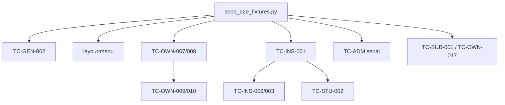

# Каталог Playwright E2E-тестов MyWay

Документ описывает **все автоматизированные E2E-тесты** фронтенда: что проверяет каждый тест, какая роль нужна, зависимости от backend и seed.

**Связанные материалы**

- Ручные шаги и ожидаемые результаты: [test-cases-by-role.md](test-cases-by-role.md)
- Матрица покрытия TC-*: [playwright-coverage-matrix.md](playwright-coverage-matrix.md)
- Запуск и очистка данных: [e2e-seed.md](e2e-seed.md)
- Структура каталога `frontend/e2e/`: [frontend/e2e/README.md](../../frontend/e2e/README.md)

**Уровни тестов**

| Уровень | Каталог / project | Backend | Кол-во |
|---------|-------------------|---------|--------|
| Integration manual | `e2e/manual/`, project `integration-manual` | обязателен | 56 |
| Smoke / UI без API | `e2e/*.spec.ts`, `catalog.spec.ts`, project `chromium` | не нужен (mock или статика) | 11 |
| **Всего** | | | **67** |

**Рекомендуемый полный прогон integration:** `cd frontend && npm run test:e2e:integration` (seed → 56 тестов → cleanup).

**Сквозная нумерация:** **E2E-001 … E2E-067** — единый порядок по этому каталогу (сначала integration manual, затем smoke). В таблицах колонка **№**; ID TC-* сохранён для связи с [test-cases-by-role.md](test-cases-by-role.md).

### Сводный указатель

| № | ID | Spec | № | ID | Spec |
|---|-----|------|---|-----|------|
| E2E-001 | TC-GEN-001 | auth | E2E-029 | TC-OWN-015 | owner-operations |
| E2E-002 | TC-GEN-002 | auth | E2E-030 | TC-OWN-016 | owner-operations |
| E2E-003 | TC-GEN-003 | auth | E2E-031 | TC-OWN-017 | owner-operations |
| E2E-004 | TC-GEN-004 | auth | E2E-032 | TC-OWN-018 | owner-operations |
| E2E-005 | TC-GEN-005 | auth | E2E-033 | TC-OWN-019 | owner-operations |
| E2E-006 | — | layout-menu | E2E-034 | TC-OWN-020 | owner-operations |
| E2E-007 | TC-SA-001 | platform | E2E-035 | TC-OWN-021 | owner-operations |
| E2E-008 | TC-SA-002 | platform | E2E-036 | TC-OWN-022 | owner-operations |
| E2E-009 | TC-SA-003 | platform | E2E-037 | TC-ADM-001 | admin |
| E2E-010 | TC-SA-004 | platform | E2E-038 | TC-ADM-002 | admin |
| E2E-011 | TC-SA-005 | platform | E2E-039 | TC-INS-001 | instructor |
| E2E-012 | TC-SA-006 | platform | E2E-040 | TC-INS-002 | instructor |
| E2E-013 | TC-SA-007 | platform | E2E-041 | TC-INS-003 | instructor |
| E2E-014 | TC-SA-008 | platform | E2E-042 | TC-INS-004 | instructor |
| E2E-015 | TC-OWN-001 | owner-settings | E2E-043 | TC-INS-005 | instructor |
| E2E-016 | TC-OWN-002 | owner-settings | E2E-044 | TC-INS-006 | instructor |
| E2E-017 | TC-OWN-003 | owner-settings | E2E-045 | TC-STU-001 | student |
| E2E-018 | TC-OWN-004 | owner-settings | E2E-046 | TC-STU-002 | student |
| E2E-019 | TC-OWN-005 | owner-settings | E2E-047 | TC-STU-003 | student |
| E2E-020 | TC-OWN-007 | owner-schedule | E2E-048 | TC-STU-004 | student |
| E2E-021 | TC-OWN-008 | owner-schedule | E2E-049 | TC-STU-005 | student |
| E2E-022 | TC-OWN-009 | owner-schedule | E2E-050 | TC-SUB-001 | sub-tenant |
| E2E-023 | TC-OWN-010 | owner-schedule | E2E-051 | TC-SUB-002 | sub-tenant |
| E2E-024 | TC-OWN-006 | owner-operations | E2E-052 | TC-SUB-003 | sub-tenant |
| E2E-025 | TC-OWN-011 | owner-operations | E2E-053 | TC-SUB-004 | sub-tenant |
| E2E-026 | TC-OWN-012 | owner-operations | E2E-054 | TC-PRV-001 | privacy |
| E2E-027 | TC-OWN-013 | owner-operations | E2E-055 | TC-PRV-002 | privacy |
| E2E-028 | TC-OWN-014 | owner-operations | E2E-056 | TC-PRV-003 | privacy |
| | | | E2E-057 | — | login.smoke |
| | | | E2E-058 | — | public-routes.smoke |
| | | | E2E-059 | — | catalog |
| | | | E2E-060 | — | catalog |
| | | | E2E-061 … E2E-063 | — | finance-manage.smoke |
| | | | E2E-064 | — | finance-pages.smoke |
| | | | E2E-065 | — | finance-turnover |
| | | | E2E-066 | — | finance-tariff-charges |
| | | | E2E-067 | — | access-pass-payment |

---

## 1. Integration manual (`integration-manual`)

Требуют `E2E_INTEGRATION=1`, живой backend (`:8080`) и frontend (`:5173`), данные из `frontend/.env.e2e` (генерируется `scripts/qa/seed_e2e_fixtures.py`).

### 1.1. Общие сценарии — `manual/auth-from-manual.spec.ts`

| № | ID | Название теста | Роль | Что делает тест |
|---|-----|----------------|------|-----------------|
| E2E-001 | TC-GEN-001 | вход с неверными учётными данными | — | Открывает `/myway/login`, вводит `wrong@example.com` / `wrongpass1`, жмёт «Войти». Проверяет, что URL остаётся на login и показывается toast с текстом про неверный пароль или имя пользователя. |
| E2E-002 | TC-GEN-002 | успешный вход OWNER | OWNER | Логин владельца из seed, переход в `/myway/{slug}/manage`. Проверяет наличие всех пунктов бокового меню OWNER (Главная, Предметы, Расписание, …, Обратная связь). |
| E2E-003 | TC-GEN-003 | регистрация новой студии | (создаётся OWNER) | На `/myway/register` заполняет форму (имя, email `studio-owner-{ts}@example.com`, пароль, название и slug `pwe2e{ts}`), ждёт подсказку «свободен», соглашается с условиями, регистрируется. Проверяет редирект на `.../manage/dashboard` с валидным slug в URL. Создаёт **новую организацию** (удаляется cleanup). |
| E2E-004 | TC-GEN-004 | публичная заявка преподавателя | — | На `/myway/{slug}/join/instructor` подаёт заявку с уникальным email, паролем, предметом из seed (или тегом «Contemporary»). Проверяет экран «Заявка отправлена» / «Регистрация завершена». |
| E2E-005 | TC-GEN-005 | публичная заявка ученика с тарифом | — | На `/myway/{slug}/join/student` выбирает предмет и тариф из seed, заполняет форму, отправляет. Проверяет успешное завершение заявки. Нужен `E2E_SEED_SUBJECT_NAME` с утверждённым тарифом. |

### 1.2. Навигация по руководству — `manual/layout-menu-from-guide.spec.ts`

| № | ID | Название теста | Роль | Что делает тест |
|---|-----|----------------|------|-----------------|
| E2E-006 | — | OWNER — меню и маршруты разделов | OWNER | После входа проверяет видимость всех пунктов сайдбара (включая «Финансы»). Поочерёдно открывает 20 маршрутов manage (dashboard, subjects, schedule, rooms, access, billing, finance*, sublease, export, …) и убеждается, что контент загружается без 404/«ошибка», есть заголовок, таблица, форма или empty-state. Соответствует гл.01 руководства пользователя. |

### 1.3. Платформа SUPER_ADMIN — `manual/platform-from-manual.spec.ts`

| № | ID | Название теста | Роль | Что делает тест |
|---|-----|----------------|------|-----------------|
| E2E-007 | TC-SA-001 | вход SUPER_ADMIN на /myway/platform | SUPER_ADMIN | Логин на платформу, проверка URL `/myway/platform` и заголовка «Платформа (SUPER_ADMIN)». |
| E2E-008 | TC-SA-002 | платформа: организации и подписка | SUPER_ADMIN | Вкладки «Тенанты» (текст «Организации и владельцы») и «Подписки» («Назначение подписки»). |
| E2E-009 | TC-SA-003 | платформа: обратная связь (тикеты) | SUPER_ADMIN | Вкладка «Обращения», таблица тикетов. |
| E2E-010 | TC-SA-004 | SUPER_ADMIN: главная из контекста студии | SUPER_ADMIN | После входа на платформу открывает `/myway/{slug}/manage/dashboard`, проверяет заголовок «Панель SUPER_ADMIN». |
| E2E-011 | TC-SA-005 | сообщение владельцу организации | SUPER_ADMIN | На панели SUPER_ADMIN → «Все тенанты», кнопка «Сообщение» у строки с slug seed-студии, отправка темы и текста, toast «Сообщение отправлено». |
| E2E-012 | TC-SA-006 | блокировка тенанта SOFT (destructive) | SUPER_ADMIN | Блокирует seed-тенант в режиме SOFT с причиной, проверяет toast. **После теста** через API снимает блокировку (`unblockTenantBySlug`). |
| E2E-013 | TC-SA-007 | негатив: финансы студии недоступны | SUPER_ADMIN | Прямой переход на `/manage/finance/turnover` в контексте студии — ожидается «Нет доступа» / 403. |
| E2E-014 | TC-SA-008 | обратная связь из меню | SUPER_ADMIN | Страница обратной связи в контексте студии, отправка тикета с темой TC-SA-008. |

**Только ручная проверка (без Playwright):**

| № | ID | Название | Роль | Что проверяет |
|---|-----|----------|------|----------------|
| — | TC-SA-025 / PLT-10 | SMTP: рассылка с ящика admin | SUPER_ADMIN | Platform → «Рассылки» → черновик по коду тарифа студии с OWNER на реальном email → «Отправить»; письмо от `PLATFORM_EMAIL_FROM`, статус EMAIL `SENT`, in-app на главной OWNER. Spec: `docs/manual-testing/test-cases-by-role.md`. |

**SUPER_ADMIN:** email в `.env.e2e`; на время прогона оркестратор ставит пароль `TestPass12` и восстанавливает исходный hash из БД.

### 1.4. Настройки владельца — `manual/owner-settings.spec.ts`

Серия **serial** (порядок важен).

| № | ID | Название теста | Роль | Что делает тест |
|---|-----|----------------|------|-----------------|
| E2E-015 | TC-OWN-001 | настройки: организация | OWNER | Вкладка «Организация» → «Редактировать» → меняет название на «Студия OWNER TC» → «Сохранить», toast «Организация обновлена». |
| E2E-016 | TC-OWN-002 | настройки: публичный сайт | OWNER | Вкладка «Публичный сайт»: описание и телефон, сохранение. Проверяет отображение на публичной странице `/myway/{slug}`. |
| E2E-017 | TC-OWN-003 | финансы для ADMIN: флаг access-control | OWNER | Вкладка настроек: включает переключатель доступа ADMIN к финансам (UI switch или API `setFinanceReportForAdmin(true)`). |
| E2E-018 | TC-OWN-004 | приглашение администратора | OWNER | Вкладка «Администраторы» → «Пригласить» → email `admin-invite-{ts}@example.com`, имя/фамилия → toast приглашения, строка в таблице. |
| E2E-019 | TC-OWN-005 | преподаватели: приглашение (smoke) | OWNER | Раздел «Преподаватели» → «Пригласить» → email `instr-invite-{ts}@example.com` → toast (без проверки почты). |

### 1.5. Расписание и справочники OWNER — `manual/owner-schedule-from-manual.spec.ts`

Серия **serial**, общий suffix для предмета/зала.

| № | ID | Название теста | Роль | Что делает тест |
|---|-----|----------------|------|-----------------|
| E2E-020 | TC-OWN-007 | предмет и публикация в каталоге | OWNER | Создаёт предмет (если нет seed) или проверяет seed-предмет; включает switch «в каталоге» / toast «введён в эксплуатацию». |
| E2E-021 | TC-OWN-008 | создание зала | OWNER | Создаёт зал с адресом (если нет seed) или проверяет seed-зал в таблице. |
| E2E-022 | TC-OWN-009 | расписание: создание занятия и удаление | OWNER | Недельный вид → «Новая запись» → заполняет занятие (зал, предмет, преподаватель, слот) → создаёт → дневной вид → открывает запись → «Удалить» → toast «Запись удалена». |
| E2E-023 | TC-OWN-010 | журнал посещаемости | OWNER | Создаёт занятие, открывает вкладку «Факт посещаемости», переключает switch, «Сохранить факт посещаемости», затем удаляет запись. |

### 1.6. Операции владельца — `manual/owner-operations.spec.ts`

| № | ID | Название теста | Роль | Что делает тест |
|---|-----|----------------|------|-----------------|
| E2E-024 | TC-OWN-006 | заявки: одобрение и отклонение | OWNER | Через API создаёт две pending-заявки преподавателя; в UI «Заявки» одобряет одну (галочка → «Одобрить»), отклоняет вторую («Отклонить»). |
| E2E-025 | TC-OWN-011 | пропуска: шаблон и выдача | OWNER | Раздел «Пропуска»: создаёт шаблон пропуска и выдаёт пропуск ученику (helper `createPassTemplateAndIssue`). |
| E2E-026 | TC-OWN-012 | пропуска: станция QR | OWNER | Вкладка «Станция / QR»: текст про станционный QR, SVG-код, интервал обновления. |
| E2E-027 | TC-OWN-013 | биллинг: тип, счётчик, показание | OWNER | Цепочка: тип коммунальной услуги → счётчик → показание для seed-зала (`createBillingUtilityChain`). |
| E2E-028 | TC-OWN-014 | финансы: сводный оборот и XLSX | OWNER | Страница сводного оборота, кнопка экспорта XLSX (`exportFinanceTurnoverXlsx`). |
| E2E-029 | TC-OWN-015 | финансы: категории и расходы | OWNER | **Smoke UI:** открывает модалку «Новая категория», закрывает; открывает «Новый расход», проверяет поля «Категория» и «Сумма». Полное сохранение расхода на стенде может давать 500 — сценарий упрощён. |
| E2E-030 | TC-OWN-016 | финансы: начисления по тарифу | OWNER | Пересчёт/просмотр начислений по тарифу (`recalcTariffCharges`). |
| E2E-031 | TC-OWN-017 | субаренда: бронирование | OWNER | Бронирует слот субаренды от имени OWNER для SUB_TENANT из seed (`createSubleaseBooking`). Skip, если нет свободных слотов. |
| E2E-032 | TC-OWN-018 | экспорт 1С | OWNER | Запуск экспорта ZIP за период (`export1cZip`). |
| E2E-033 | TC-OWN-019 | новости: создание | OWNER | «Новая запись», заголовок, статус «Черновик», сохранение, строка в списке. |
| E2E-034 | TC-OWN-020 | график админов: правило | OWNER | Добавляет правило в графике работы админов (`addAdminWorkRule`). |
| E2E-035 | TC-OWN-021 | личный кабинет | OWNER | Раздел «Личный кабинет»: карточки расписания/QR (`assertOwnerMeCards`). |
| E2E-036 | TC-OWN-022 | обратная связь | OWNER | Отправка обращения с темой TC-OWN-022, сообщение «Автотест OWNER feedback». |

### 1.7. Администратор — `manual/admin.spec.ts`

Серия **serial**.

| № | ID | Название теста | Роль | Что делает тест |
|---|-----|----------------|------|-----------------|
| E2E-037 | TC-ADM-001 | негатив: финансы без флага | ADMIN | OWNER через API выключает `financeReportForAdmin`. ADMIN логинится — в меню **нет** «Финансы»; GET `/finance/turnover/summary` → ≥403. |
| E2E-038 | TC-ADM-002 | позитив: финансы с флагом | ADMIN | OWNER включает флаг в настройках; ADMIN заходит на «Сводный оборот», видит контент финансов. |

### 1.8. Преподаватель — `manual/instructor.spec.ts`

Серия **serial**; TC-INS-002/003 зависят от занятия из TC-INS-001.

| № | ID | Название теста | Роль | Что делает тест |
|---|-----|----------------|------|-----------------|
| E2E-039 | TC-INS-001 | расписание: создание | INSTRUCTOR | Создаёт занятие в расписании (зал, предмет seed, свой email в поле преподавателя). |
| E2E-040 | TC-INS-002 | негатив: удаление записи | INSTRUCTOR | Открывает созданное занятие, жмёт «Удалить» — ожидает HTTP ≥403 на DELETE, диалог остаётся открытым. |
| E2E-041 | TC-INS-003 | посещаемость: вкладка и сохранение | INSTRUCTOR | Вкладка «Факт посещаемости»: сохранение посещаемости или disabled switch. |
| E2E-042 | TC-INS-004 | тариф на своём предмете | INSTRUCTOR | В «Предметах» при наличии кнопки тарифа — добавляет план «Тариф TC» с ценой 1500. |
| E2E-043 | TC-INS-005 | пропуска: без станции QR | INSTRUCTOR | В «Пропусках» **нет** вкладки «Станция / QR»; видна таблица или empty. |
| E2E-044 | TC-INS-006 | личный кабинет: расписание и QR | INSTRUCTOR | «Личный кабинет»: блоки «Моё расписание» и QR/проходная. |

### 1.9. Ученик — `manual/student.spec.ts`

| № | ID | Название теста | Роль | Что делает тест |
|---|-----|----------------|------|-----------------|
| E2E-045 | TC-STU-001 | расписание: создание запрещено | STUDENT | POST `/schedule/entries` с токеном STUDENT → статус ≥403. |
| E2E-046 | TC-STU-002 | негатив: посещаемость | STUDENT | Открывает занятие в расписании (из API), вкладка посещаемости скрыта или switch disabled. |
| E2E-047 | TC-STU-003 | пропуска: свои, без станции QR | STUDENT | Нет вкладки «Станция / QR»; список своих пропусков. |
| E2E-048 | TC-STU-004 | личный кабинет: расписание и QR | STUDENT | «Личный кабинет»: расписание и QR. |
| E2E-049 | TC-STU-005 | негатив: заявки | STUDENT | Страница заявок без кнопок «Одобрить»; API approve join → ≥403. |

### 1.10. Субарендатор — `manual/sub-tenant.spec.ts`

Серия **serial**.

| № | ID | Название теста | Роль | Что делает тест |
|---|-----|----------------|------|-----------------|
| E2E-050 | TC-SUB-001 | субаренда: бронирование | SUB_TENANT | Логин SUB_TENANT, бронирование свободного слота в субаренде (`createSubleaseBooking`). Skip без слотов. |
| E2E-051 | TC-SUB-002 | негатив: создание зала | SUB_TENANT | Попытка «Добавить зал» → POST `/api/rooms` ≥403 или кнопка скрыта. |
| E2E-052 | TC-SUB-003 | негатив: экспорт 1С | SUB_TENANT | POST `/export/1c` с токеном SUB_TENANT → ≥403. |
| E2E-053 | TC-SUB-004 | личный кабинет: QR без расписания | SUB_TENANT | «Личный кабинет»: есть QR/проходная, **нет** блока «Моё расписание». |

### 1.11. Персональные данные — `manual/privacy.spec.ts`

| № | ID | Название теста | Роль | Что делает тест |
|---|-----|----------------|------|-----------------|
| E2E-054 | TC-PRV-001 | экспорт данных | STUDENT | `/myway/account/privacy` → скачивание JSON экспорта персональных данных или сообщение «Экспорт скачан». |
| E2E-055 | TC-PRV-002 | удаление аккаунта (destructive) | STUDENT | API: публичная заявка ученика → одобрение OWNER → вход → «Удалить аккаунт» с подтверждением email. Создаёт и удаляет одноразового пользователя. |
| E2E-056 | TC-PRV-003 | негатив: удаление OWNER | OWNER | Кнопка «Удалить аккаунт» disabled или виден тег роли OWNER. |

---

## 2. Smoke и UI-тесты без полного backend (`chromium`)

Запуск: `npm run build && npm run test:e2e` (CI) или `npx playwright test --project=chromium`. Backend **не обязателен** — ответы API подменяются `page.route` или проверяется только статика.

### 2.1. `login.smoke.spec.ts`

| № | Название | Что делает тест |
|---|----------|-----------------|
| E2E-057 | login page shows form | Открывает `/myway/login`, проверяет видимость карточки входа, поля email (`login-email`) и кнопки «Войти» (`login-submit`). |

### 2.2. `public-routes.smoke.spec.ts`

| № | Название | Что делает тест |
|---|----------|-----------------|
| E2E-058 | schedule page loads shell | При заданном `E2E_TENANT_SLUG` открывает публичное расписание `/myway/{slug}/schedule`, проверяет, что body отрисован. Без slug — skip. |

### 2.3. `catalog.spec.ts`

| № | Название | Что делает тест |
|---|----------|-----------------|
| E2E-059 | qa-catalog.json loads and lists case IDs | Читает `generated/qa-catalog.json` (экспорт из xlsx), проверяет количество кейсов и наличие ID `PUB-01`. |
| E2E-060 | each case has role flags | Для каждого кейса в каталоге проверяет наличие `id` и объекта `rolesApplicable`. |

### 2.4. `finance-manage.smoke.spec.ts`

| № | Название | Что делает тест |
|---|----------|-----------------|
| E2E-061 | finance categories redirects to login | Mock org `demo`; неавторизованный переход на `/manage/finance/categories` → редирект на login. |
| E2E-062 | finance expenses redirects to login | То же для `/finance/expenses`. |
| E2E-063 | finance tariff charges redirects to login | То же для `/finance/tariff-charges`. |

### 2.5. `finance-pages.smoke.spec.ts`

| № | Название | Что делает тест |
|---|----------|-----------------|
| E2E-064 | finance routes resolve and show tenant not found fallback | Три маршрута finance для slug `demo` без mock org — страница «Студия не найдена» и кнопка «На главную MyWay». |

### 2.6. `finance-turnover.spec.ts`

| № | Название | Что делает тест |
|---|----------|-----------------|
| E2E-065 | owner sees turnover table and can open chart drawer | Mock: токен в localStorage, `/auth/me` как OWNER, сводный оборот с категорией «Абонементы». Проверяет заголовок, «Экспорт XLSX», клик по категории → drawer «Динамика: Абонементы». |

### 2.7. `finance-tariff-charges.spec.ts`

| № | Название | Что делает тест |
|---|----------|-----------------|
| E2E-066 | owner sees tariff charges list and month confirm button | Mock списка начислений Hip-Hop. Ожидает заголовок «Начисления по тарифу», кнопку «Подтвердить все начисления за месяц», ячейку Hip-Hop. *На текущем UI кнопка может отсутствовать — тест может падать.* |

### 2.8. `access-pass-payment.spec.ts`

| № | Название | Что делает тест |
|---|----------|-----------------|
| E2E-067 | owner can mark pass paid and refunded | Mock пропуска на вкладке «Активные пропуска»: «Отметить оплату» (сумма 4800) → «Оформить возврат» с причиной → «Возврат сохранён». |

---

## 3. Зависимости между тестами



- **ADMIN:** E2E-038 (TC-ADM-002) зависит от флага E2E-017 (TC-OWN-003) или шага внутри E2E-038.
- **INSTRUCTOR:** E2E-040, E2E-041 требуют занятие из E2E-039 (TC-INS-001).
- **STUDENT:** E2E-046 нужно занятие в расписании (E2E-039 или E2E-022).
- **Субаренда:** E2E-031 и E2E-050 делят слоты; на свежем seed оба проходят.

---

## 4. Данные, создаваемые тестами (cleanup)

После `npm run test:e2e:integration` или `global-teardown` скрипт `cleanup_e2e_fixtures.py` удаляет:

| Паттерн | Источник |
|---------|----------|
| Организации `slug` ~ `e2e-*`, `pwe2e*` | seed, E2E-003 (TC-GEN-003) |
| Пользователи `@example.com` с префиксами `e2e-`, `studio-owner-`, `instr-pw-`, `student-pw-`, `admin-invite-`, `instr-invite-` | seed, TC-GEN-003–005, TC-OWN-004/005, join/privacy и др. (включая сирот без студии) |

**Не удаляется:** учётка SUPER_ADMIN (только восстанавливается пароль).

---

## 5. Команды запуска

```powershell
# Полный integration (рекомендуется)
cd frontend
npm run test:e2e:integration

# Только smoke (CI-подобный)
npm run build
npm run test:e2e

# Только manual, если seed уже есть
cd frontend
# загрузить .env.e2e в окружение
npx playwright test --project=integration-manual --workers=1
```

HTML-отчёт: `npx playwright show-report` из каталога `frontend`.
