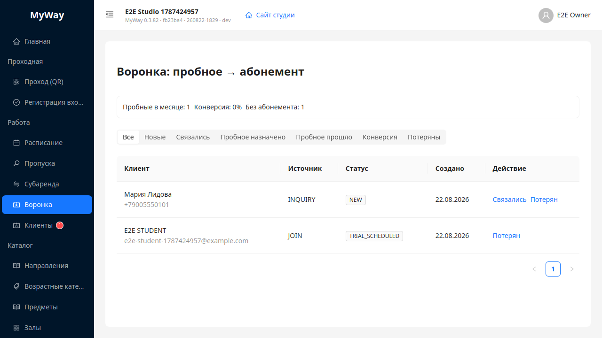

# MyWay — платформа для студий саморазвития

**Ссылка для клиентов:** [https://myway-line.ru/product](https://myway-line.ru/product)  
Лендинг и регистрация: [https://myway-line.ru/go/](https://myway-line.ru/go/)

MyWay — облачный кабинет студии. Расписание, залы, абонементы, проход по QR, клиенты, преподаватели, субаренда и финансы живут в одном месте вместо таблиц, мессенджеров и разрозненных сервисов.

Регистрация бесплатна: сразу после создания студии доступен тестовый период без оплаты.

---

## Для кого

| Сегмент | Что закрывает |
|---------|----------------|
| Танцевальная студия | Группы, залы и абонементы — от записи до отметки на занятии |
| Йога и wellness | Потоки, листы ожидания и напоминания студентам |
| Музыкальная школа | Индивидуальные и групповые уроки, преподаватели, учёт посещений |
| Арендодатель залов | Сдача помещений студиям и преподавателям, договоры и слоты |

---

## Что умеет система

### Публичный сайт студии

У каждой студии — своя страница по адресу `/go/<имя-студии>`: расписание, преподаватели, направления, новости, отзывы и заявки с сайта. Студия выглядит как отдельный сервис, без кабинета платформы на витрине.

### Расписание

Сетка занятий на день, неделю и месяц. Занятия, аренда, обслуживание и блокировки зала. Повторяющиеся слоты, замена преподавателя на одно вхождение, отработка пропусков, факт посещаемости.

### Залы и каталог

Помещения и залы с вместимостью, оборудованием и цветом в сетке. Направления, возрастные категории и предметы — витрина студии без отдельных «поурочных» тарифов: цены живут в абонементах.

### Абонементы и проход

Разовое посещение, пакет, безлимит и комбинированные тарифы. Продажа, подтверждение оплаты, заморозка, учёт визитов. На ресепшене — регистрация входа и станционный QR; студент может отметиться сам.

### Клиенты, семьи и воронка

База студентов и субарендаторов, заявки с сайта, семейные кабинеты (родитель и дети). Воронка: новые заявки → связь → пробное → конверсия.

### Преподаватели и персонал

Приглашения сотрудников, график, заявки на отсутствие и замену. Роли с разными правами: владелец, администратор, преподаватель, студент, субарендатор, клинер.

### Субаренда и коммуналка

Сдача залов другим студиям и преподавателям, брони и счета. Перевыставление коммуналки арендаторам по фактическому использованию — без отдельной таблички.

### Финансы и 1С

Сводный оборот по залам, преподавателям и субарендаторам. Доходы (абонементы, билеты, субаренда, коммуналка, ручные поступления), расходы, категории. Экспорт в 1С за период.

---

## Кто работает в кабинете

| Роль | Зачем |
|------|--------|
| Владелец | Полный кабинет: расписание, финансы, персонал, настройки, публичный сайт |
| Администратор | Операции дня: запись, пропуска, клиенты; финансы — только если владелец открыл доступ |
| Преподаватель | Своё расписание, состав групп, посещаемость |
| Студент | Запись, абонемент, отметка на занятии, новости студии |
| Субарендатор | Свои брони и счета за залы |
| Клинер | Проход по графику смены |

Данные студий изолированы друг от друга. Платформа не показывает финансовый оборот одной студии чужим организациям.

---

## Тарифы платформы

Рекомендуем годовую оплату (год = 10 месяцев). Пилотный тариф — условия Start за 29 900 ₽/год, пока на платформе меньше пяти пилотных студий.

| | **Пилотный** | **Start** | **Pro** | **Enterprise** |
|---|--------------|-----------|---------|----------------|
| Цена | **29 900 ₽/год** · 2 990 ₽/мес | **49 900 ₽/год** · 4 990 ₽/мес | **99 900 ₽/год** · 9 990 ₽/мес | По договору |
| Квота | до 5 студий на платформе | — | — | — |
| Залы | до 10 | до 10 | до 30 | без потолка |
| Пользователи | до 50 | до 50 | до 200 | без потолка |
| Check-in / мес. | 3 000 | 3 000 | 20 000 | по договору |
| Состав | Как Start | Расписание, абонементы, публичный сайт, экспорт в 1С | Всё из Start + субаренда, коммуналка, финансовые отчёты, приоритетная поддержка | Всё из Pro + индивидуальные лимиты, онбординг, договор и счёт для юрлица |

---

## Как начать

1. Откройте [myway-line.ru/go/](https://myway-line.ru/go/) и создайте пространство студии.
2. Заполните залы, предметы и шаблоны абонементов.
3. Пригласите администратора и преподавателей.
4. Опубликуйте страницу студии и примите первые заявки.

Нужна демонстрация на ваших сценариях — форма на лендинге или письмо на [support@myway-line.ru](mailto:support@myway-line.ru). Обычно созвон занимает 30–40 минут.
