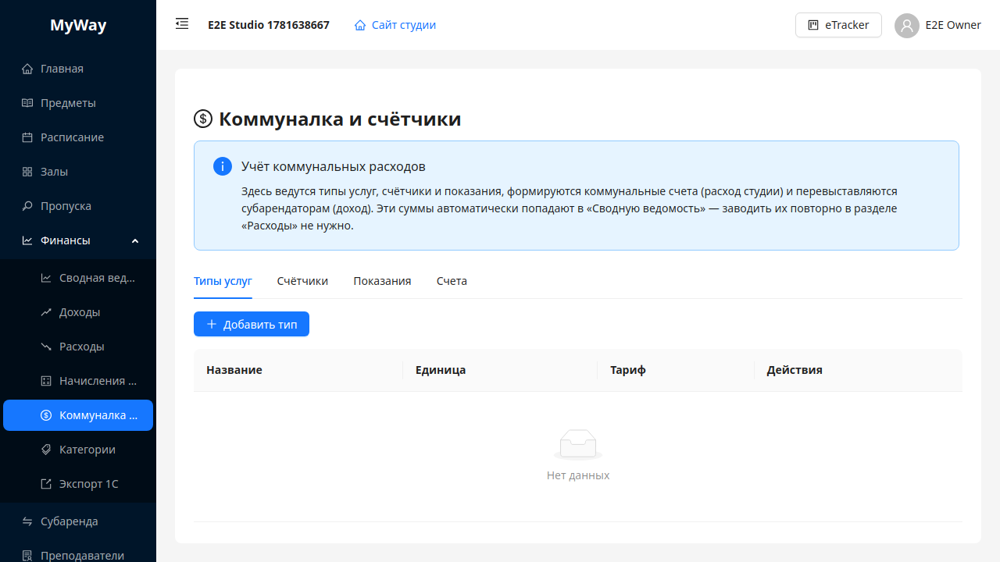

# Коммуналка и счётчики

> Бывший раздел **«Биллинг»**. С релиза 0.3.x он входит в раздел **«Финансы»** (подменю **«Коммуналка и счётчики»**, путь `/go/<slug>/manage/finance/utilities`). Старая ссылка `/manage/billing` перенаправляется сюда автоматически.

Раздел предназначен для учёта **коммунальных ресурсов** по помещениям: типы услуг (электроэнергия, вода, тепло и т.д.), **счётчики**, внесение **показаний** и формирование **счетов**. Коммунальные счета — это **расход** студии; их можно **перевыставить субарендаторам** (тогда возникает **доход** «возмещение коммуналки»). Эти суммы автоматически попадают в **«Сводную ведомость»** (см. [07-finansy.md](./07-finansy.md)) — заводить их повторно в разделе **«Расходы»** не нужно.

## Вкладки

1. **Типы услуг** — карточный каталог единиц измерения (`кВт·ч`, `м³`, `Гкал`). Создание/редактирование через модальные формы с кнопками подтверждения.
2. **Счётчики** — привязка счётчика к типу услуги и **помещению** из справочника залов; заводской номер и параметры в модалках **«Добавить»** / **«Изменить»**.
3. **Показания** — выбор счётчика в верхнем селекте (подпись строится как «номер (тип, зал)»); таблица истории показаний; добавление нового показания через модальное окно.
4. **Счета** — список выставленных счетов со статусами **Черновик**, **Отправлен**, **Оплачен**, **Просрочен**; действия по смене статуса и удалению (по правам).

## Права

Управляющие операции (создание типов, счётчиков, показаний, счетов) рассчитаны на **OWNER** и **ADMIN**. Часть read-only API доступна шире — ориентируйтесь на ответ сервера при тестировании.

---

Дальше: [07-finansy.md](./07-finansy.md).
