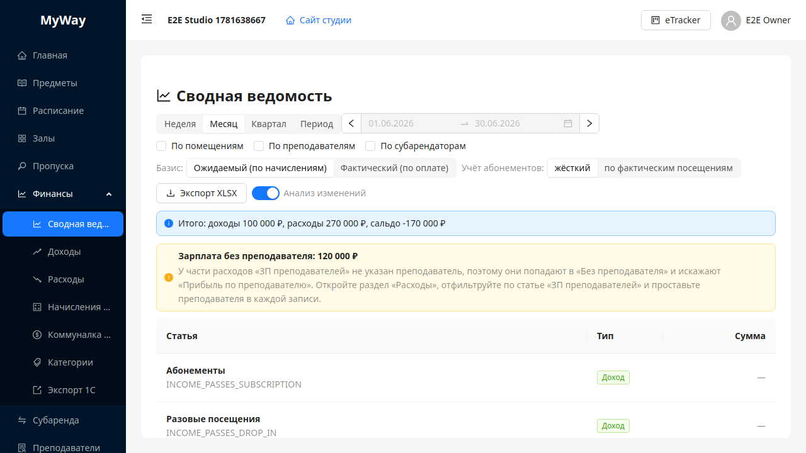
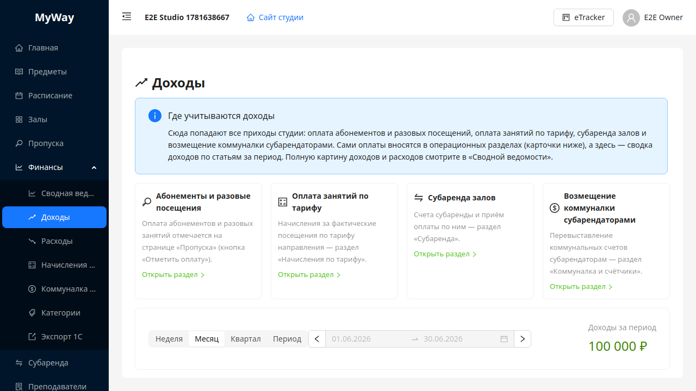
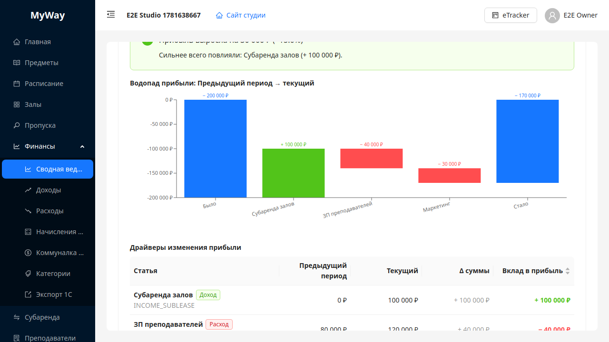

# Финансы

Раздел **«Финансы»** — единое место для всего, что касается денег студии: куда вносить **расходы** (аренда, зарплата, налоги, коммуналка), где учитываются **доходы** (абонементы, оплата занятий, субаренда) и как смотреть **сводную ведомость** с анализом прибыли. Доступ определяется **активной версией платформенного тарифа** организации (feature `finance.turnoverReport` в JSON версии плана) и для роли **ADMIN** — флагом организации, который может включить только **владелец**.

## Кто видит раздел «Финансы»

| Роль | Условие |
|------|---------|
| **OWNER** | Тариф включает модуль (`finance.turnoverReport` ≠ false) |
| **ADMIN** | Тот же тариф **и** у организации включён флаг `financeReportForAdmin` (в JWT/UI приходит как `accessControl.financeReportForAdmin`) |
| **INSTRUCTOR, STUDENT, SUB_TENANT** | Пункт **«Финансы»** в меню **не показывается** |
| **SUPER_ADMIN** | Пункт отсутствует (финансы тенанта недоступны) |

Переключателя «разрешить финансы админу» в интерфейсе настроек **пока нет** — владелец меняет флаг через API `PATCH /api/organizations/{id}/access-control` с телом `{ "financeReportForAdmin": true|false }`. При появлении переключателя в UI используйте его.

## Структура раздела

Навигация — через **боковое меню** (подменю «Финансы»); отдельной строки вкладок наверху страницы больше нет. Пункты подменю:

| Пункт | Назначение |
|-------|------------|
| **Сводная ведомость** | Сводный оборотный отчёт по статьям доходов/расходов с разрезами (помещения, преподаватели, субарендаторы), графиком drill-down, экспортом в **XLSX** и блоком **«Анализ изменений»**. |
| **Доходы** | Обзор приходов: где они учитываются (карточки-источники) и сводка доходов по статьям за период. |
| **Расходы** | Журнал расходных операций с привязкой к категории/залу/преподавателю/субарендатору. |
| **Начисления по тарифу** | Начисления за фактические посещения по тарифу направления; пересчёт и помесячное подтверждение. |
| **Коммуналка и счётчики** | Бывший «Биллинг»: типы услуг, счётчики, показания, коммунальные счета и их перевыставление субарендаторам ([06-billing.md](./06-billing.md)). |
| **Категории** | Справочник статей для классификации и правил распределения в отчёте. |
| **Экспорт 1С** | Выгрузка данных в формате 1С ([08-subarenda-i-eksport.md](./08-subarenda-i-eksport.md)). |

> Бывшие пункты верхнего уровня «Биллинг» и «Экспорт 1С» переехали сюда. Старые ссылки `/manage/billing` и `/manage/export` перенаправляются на `/manage/finance/utilities` и `/manage/finance/export`.

## Доходы

Страница **«Доходы»** отвечает на вопрос «где учитываются приходы». Сами оплаты вносятся в операционных разделах — на странице есть карточки-ссылки на источники:

| Источник дохода | Где вносится |
|-----------------|--------------|
| **Абонементы и разовые посещения** | «Пропуска» — кнопка «Отметить оплату» ([05-propusk.md](./05-propusk.md)) |
| **Оплата занятий по тарифу** | «Начисления по тарифу» (см. ниже) |
| **Субаренда залов** | «Субаренда» — счёт и приём оплаты ([08-subarenda-i-eksport.md](./08-subarenda-i-eksport.md)) |
| **Возмещение коммуналки субарендаторами** | «Коммуналка и счётчики» — перевыставление ([06-billing.md](./06-billing.md)) |

Ниже карточек — фильтр периода, показатель **«Доходы за период»** и таблица доходов по статьям с итогом. Ручного ввода «прочего дохода» на этой странице пока нет — доходы приходят из перечисленных источников.

## Расходы

Здесь вносятся расходы студии **вручную**: **аренда** помещений, **зарплата** преподавателям, администраторам, уборщицам, **маркетинг**, **налоги**, хозтовары и прочее. Привязывайте запись к залу, преподавателю или субарендатору — тогда она попадёт в нужный разрез «Сводной ведомости».

- **Коммуналку по счётчикам** здесь заводить не нужно — она считается в разделе **«Коммуналка и счётчики»**.
- **Абонентская плата платформы** добавляется автоматически.
- Эти суммы и так попадают в «Сводную ведомость» и **не дублируются**.

По умолчанию выбран текущий месяц. Доступны фильтры по периоду, категории и залу; добавление — кнопкой **«Добавить расход»**.

## Сводная ведомость

Главный экран раздела — сводный оборотный отчёт.

- **Пресет периода**: **«Неделя»**, **«Месяц»** (по умолчанию), **«Квартал»**, **«Период»** (произвольный диапазон).
- Чекбоксы группировки (**«По помещениям»**, **«По преподавателям»**, **«По субарендаторам»**) меняют разрез таблицы (pivot) и включают подытоги «Прибыль по …».
- Переключатель **«Базис»** (см. ниже).
- Переключатель **«Учёт абонементов»**: **«жёсткий»** или **«по фактическим посещениям»**.
- Кнопка **«Экспорт XLSX»** выгружает текущую конфигурацию фильтров (с учётом базиса и режима абонементов).
- Тумблер **«Анализ изменений»** включает/выключает аналитический блок под таблицей.

Над таблицей — строка **«Итого: доходы … расходы … сальдо …»**; в подвале таблицы дублируются строки **«Итого доходы»**, **«Итого расходы»**, **«Сальдо»**. Клик по строке/ячейке открывает график динамики (drill-down) с топ-операциями.

## Базис учёта: ожидаемый и фактический

Переключатель **«Базис»** задаёт момент признания сумм:

| Базис | Что показывает |
|-------|----------------|
| **Ожидаемый (по начислениям)** | По факту возникновения обязательства, **независимо от оплаты**: абонементы — по дате выдачи; тариф — начисленные и оплаченные (`Начислен`/`Оплачен`); субаренда — выставленные счета на полную сумму; коммуналка — за период потребления; подписка платформы — по выставленным инвойсам. |
| **Фактический (по оплате)** | Только **реальное движение денег**: абонементы — по дате оплаты; тариф — только `Оплачен`; субаренда — только оплаченные счета на оплаченную сумму; коммуналка — только оплаченные счета; подписка — по платежам. |

Ручные **расходы** и **возмещение коммуналки** считаются одинаково в обоих базисах (у них в системе нет отдельного факта оплаты). Базис применяется ко всему разделу «Сводная ведомость», включая график, экспорт и «Анализ изменений».

## Анализ изменений

Блок под таблицей отвечает на вопрос **«почему изменилась прибыль»** — сравнение текущего периода с базой:

- **База сравнения**: **«Предыдущий период»** (по умолчанию) или **«Год назад»**; для предыдущего можно сравнить сразу несколько периодов («Периодов в сравнении»: 1–3) и увидеть динамику.
- **KPI-карточки** Доходы / Расходы / Прибыль с дельтой и процентом к базе (цвет и стрелка показывают «лучше/хуже»).
- **Авто-резюме**: насколько изменилась прибыль и какие статьи сильнее всего повлияли.
- **Водопад прибыли**: от прибыли прошлого периода через вклады статей к текущей.
- **Драйверы изменения прибыли**: по каждой статье — было/стало, изменение суммы и вклад в изменение прибыли (сумма вкладов равна изменению сальдо).
- При выбранной группировке — таблица **«Изменение прибыли по помещениям/преподавателям/субарендаторам»** с дельтами по каждому значению.

## Начисления по тарифу

Страница показывает строки начислений со статусами **«Черновик»**, **«Начислен»**, **«Оплачен»**, **«Списан»**. Используйте фильтры по периоду, статусу и направлению (предмету).

Кнопка **«Пересчитать за период»** запускает пересчёт начислений по выбранным фильтрам. Кнопка **«Подтвердить все начисления …»** массово подтверждает начисления за выбранный период.

## Важно для администратора

Если пункта **«Финансы»** нет в меню, владелец не выдал право на финансовый отчёт (`financeReportForAdmin`) или тариф не включает модуль.

---

Дальше: [08-subarenda-i-eksport.md](./08-subarenda-i-eksport.md).
