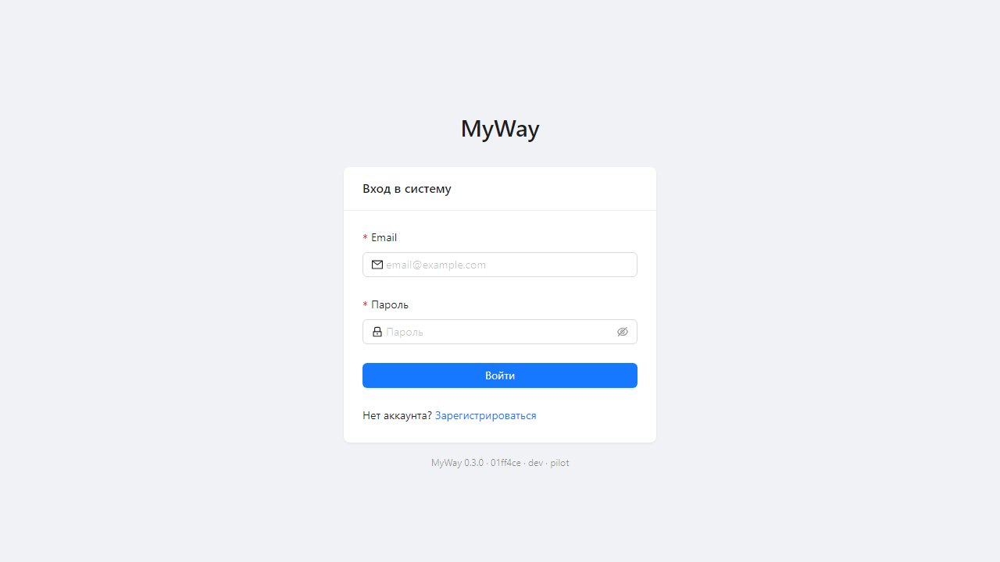
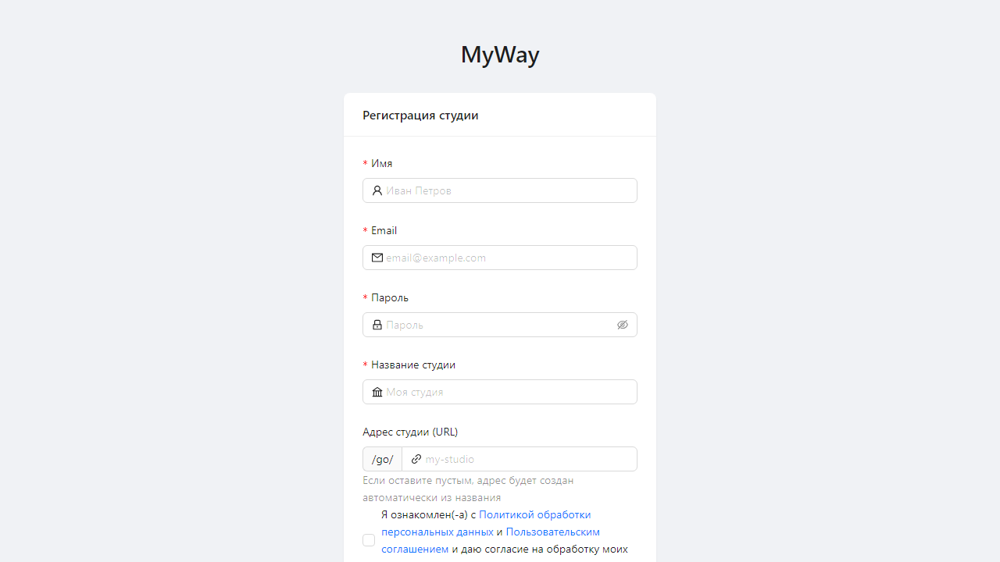

# Введение: роли и адреса

## Назначение MyWay

MyWay — веб-приложение для студий и школ: расписание, учёт посещений и пропусков, биллинг помещений, субаренда, финансовые отчёты (при включённом тарифе), публичная страница организации и приём заявок от преподавателей и учеников.

## Основные URL

В интерфейсе используется префикс **`/go`**. Запросы к старым путям **`/myway/...`** перенаправляются на **`/go/...`** (обратная совместимость).

| Назначение | Путь |
|------------|------|
| Лендинг платформы | `/go/` |
| Вход | `/go/login` |
| Регистрация новой студии (первый владелец) | `/go/register` |
| Приватность и экспорт ПДн | `/go/account/privacy` |
| Панель платформы | `/go/platform` |
| Публичная страница студии | `/go/<slug>` |
| Запись преподавателем | `/go/<slug>/join/instructor` |
| Запись учеником | `/go/<slug>/join/student` |
| Рабочий кабинет организации | `/go/<slug>/manage/...` |

`<slug>` — короткий адрес студии (латиница), задаётся при регистрации или автоматически из названия.

## Роли пользователей

### В организации (тенант)

| Код роли | Кто это |
|----------|---------|
| `OWNER` | Владелец студии, полные права; может включить администраторам доступ к финансовому отчёту. |
| `ADMIN` | Администратор: операционное управление; финансы — если позволил владелец и тариф. |
| `INSTRUCTOR` | Преподаватель: расписание, посещаемость, тарифы по своим предметам. |
| `STUDENT` | Ученик: расписание, пропуска, отметка прохода. |
| `SUB_TENANT` | Субарендатор: бронирования в модуле субаренды. |

### Операторы платформы

| Код роли | Кто это |
|----------|---------|
| `SUPER_ADMIN` | Полное управление платформой, операторами, тарифами и версиями. |
| `SUPER_USER` | Управление тенантами, подписками, тарифами, рассылками; **без** создания других операторов. |

Операторы платформы **не** имеют доступа к финансовым данным конкретной студии. Подробнее: [14-platforma-super-admin.md](./14-platforma-super-admin.md).

Дальше см. [01-layout-i-menu.md](./01-layout-i-menu.md) и главы по разделам.

## Вход в систему

1. Откройте `/go/login`.
2. Поля карточки **«Вход в систему»**: **Email**, **Пароль**.
3. Нажмите **«Войти»**.

После успешного входа:

- **SUPER_ADMIN** или **SUPER_USER** → `/go/platform`;
- участник организации → `/go/<slug>/manage/dashboard`.

Внизу страницы входа может отображаться **версия** и build-stamp продукта.

При ошибке — уведомление (например «Неверный пароль или имя пользователя!»).

## Регистрация новой студии

Страница `/go/register`, заголовок **«Регистрация студии»**.

Основные поля:

- **Имя**, **Email**, **Пароль** (не короче 8 символов).
- **Название студии**.
- **Адрес студии (URL)** — необязательный slug; подсказка доступности `/go/<slug>`.
- Согласие с политикой и пользовательским соглашением.
- Опционально — маркетинговые письма.

**«Зарегистрироваться»** создаёт организацию, назначает пользователя **OWNER** и автоматически выдаёт **платформенную подписку** (по умолчанию план **`TEST_OWNER_FREE`**, актуальная ACTIVE-версия тарифа). Подробнее: [platform-subscription-plans.md](../../platform-subscription-plans.md).
