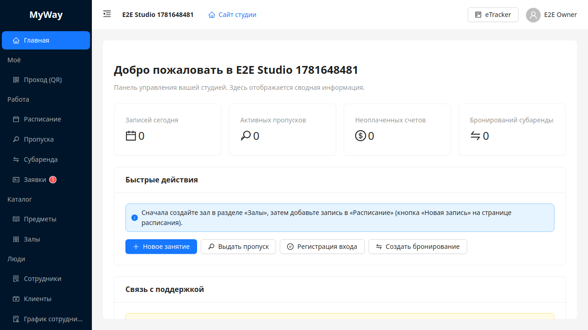

# Интерфейс рабочей области студии

Раздел описывает экран `/go/<slug>/manage/*` для участников организации (не операторов платформы). Меню **адаптируется под роль и устройство**: каждый видит только нужные ему разделы. Для **SUPER_ADMIN** / **SUPER_USER** меню сокращено — см. [14-platforma-super-admin.md](./14-platforma-super-admin.md).

*Рис. 1. Левое меню (сгруппированное) и область контента — пример для владельца.*

## Верхняя часть

- **Слева** — кнопка сворачивания боковой панели.
- Рядом — **название текущей организации**.
- **Справа** — кнопка **eTracker** (для OWNER/ADMIN) и аватар с именем пользователя; по клику открывается выпадающее меню профиля.

### Меню профиля (шапка)

Подписи как в интерфейсе. Меню очищено от дублей разделов сайдбара:

- **Организация** → настройки, вкладка «Организация» (**только OWNER**)
- **Владелец** → настройки, вкладка «Владелец» (**только OWNER**)
- **Профиль и безопасность** → настройки с `?tab=security`
- **Профиль и приватность** → `/go/account/privacy`
- **Выйти**

У **SUPER_ADMIN** / **SUPER_USER**: **Платформа**, **Профиль**, **Профиль и приватность**, **Выйти**.

## Левая колонка (боковое меню, десктоп)

Заголовок **MyWay** (в свёрнутом виде — **MW**). Пункты **сгруппированы по смыслу**; состав групп зависит от роли (см. таблицу ниже и `role-*.md`).

| Группа | Пункты |
|--------|--------|
| *(без заголовка)* | **Главная** |
| **Моё** | Моё расписание, Проход (QR), Мои пропуска, Субаренда, Обращения *(набор зависит от роли)* |
| **Работа** | Расписание, Пропуска, Субаренда, Заявки |
| **Каталог** | Предметы, Залы |
| **Люди** | Сотрудники, Клиенты, График сотрудников, Обращения |
| **Финансы** | Сводная ведомость, Доходы, Расходы, Начисления по тарифу, Коммуналка и счётчики, Категории, Экспорт 1С |
| **Студия** | Новости |
| *(без заголовка)* | Настройки, Обратная связь |

Группы «Работа», «Каталог», «Люди», «Финансы», «Студия» и пункт «Настройки» видят **только OWNER/ADMIN**. Лёгкие роли (INSTRUCTOR, STUDENT, SUB_TENANT, CLEANER) видят свою группу **«Моё»** + read-only «Предметы» + «Обратная связь». «Заявки» и «Обращения» в группе «Люди» показывают **бейдж** количества новых (только OWNER/ADMIN). Раздел «Финансы» дополнительно зависит от тарифа/флагов (см. [07-finansy.md](./07-finansy.md)).

> **Важно (изменение 2026).** Раньше меню было одинаковым для всех ролей, а ограничения срабатывали только на сервере (403). Теперь **пункты и кнопки, недоступные роли, скрыты** в интерфейсе, а прямой переход по URL к чужому разделу (финансы, экспорт, заявки, обращения) **перенаправляет на «Главную»**. Просмотровые справочники (Предметы, Расписание, Залы) остаются доступны для чтения.

## Мобильная версия

На телефоне сайдбара нет. Внизу экрана — **панель быстрой навигации** (4 пункта, зависят от роли, например: «Главная», «Моё расписание», «Проход (QR)», «Ещё»). Кнопка **«Ещё»** открывает выдвижную панель (drawer) с полным меню роли и ссылкой **«Сайт студии»**.

«Тяжёлые» разделы доступны **только на компьютере** (скрыты в мобильном меню): Финансы, Экспорт 1С, Сотрудники, Клиенты, График сотрудников, Новости, Публичный сайт, Настройки.

## Страница «Главная» (роле-зависимая)

«Главная» подстраивается под роль:

- **OWNER / ADMIN** — дашборд студии: карточки статистики, **«Быстрые действия»** («Новое занятие», «Выдать пропуск», «Регистрация входа», «Создать бронирование»); у владельца дополнительно блок **«Связь с поддержкой»**.
- **STUDENT** — личная главная: приветствие, **«Ближайшее занятие»**, **«Мой пропуск»**, кнопка **«Отметиться по QR»**, ссылки на расписание и предметы (см. [11-lichniy-kabinet.md](./11-lichniy-kabinet.md)).
- **INSTRUCTOR** — кабинет преподавателя: ближайшее занятие с кнопкой «Вести занятие · посещаемость», быстрые действия (расписание, регистрация входа, предметы и тарифы).
- **SUB_TENANT** — ближайшее бронирование и кнопка «Забронировать зал».
- **CLEANER** — кнопка «Отметиться по QR» и переход в «Обращения».

## Область контента

Белая карточка: страница выбранного раздела (таблицы, формы, графики).

---

Дальше: [02-raspisanie-podrobno.md](./02-raspisanie-podrobno.md).
