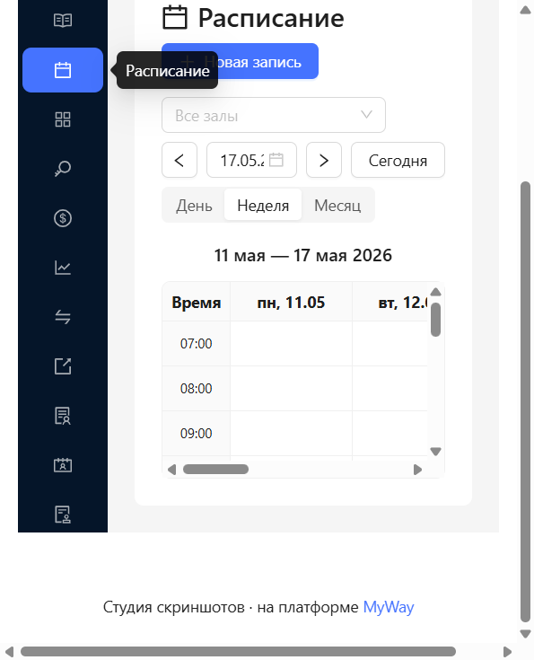
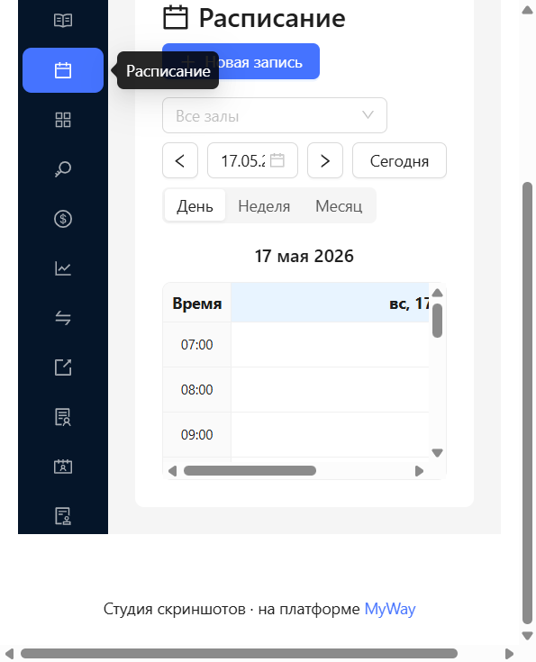
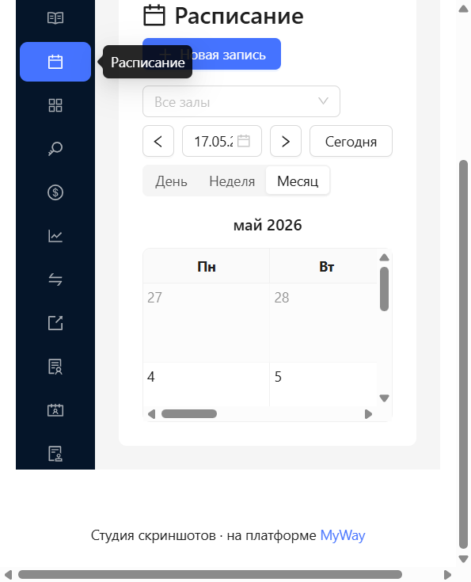
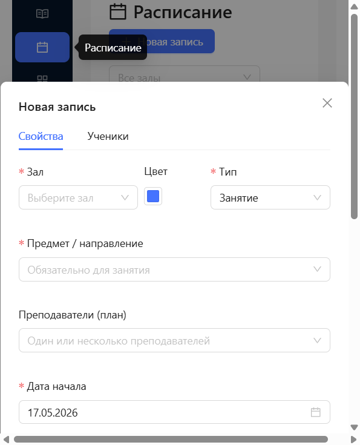
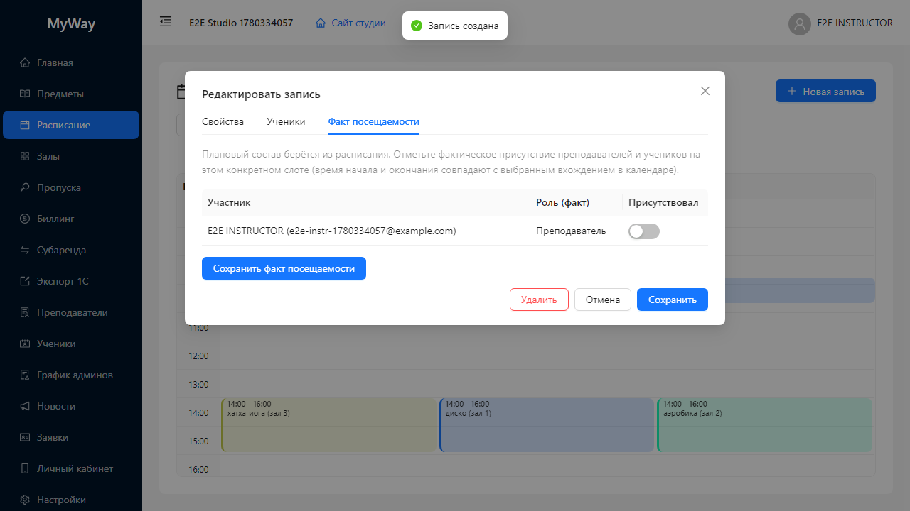

# Расписание — подробное руководство

Раздел **«Расписание»** предназначен для планирования занятости залов во времени: занятия с учениками и преподавателями, аренда, техническое обслуживание, блокировки слотов. От сюда же для занятий типа «Занятие» ведётся **фактическая посещаемость** по конкретным датам вхождения серии.

  
*Рис. 1. Сетка «Время × дни» (файл см. [assets/README.md](../assets/README.md)).*

---

## 1. Зачем нужен этот раздел

| Задача | Как решается в расписании |
|--------|---------------------------|
| Показать загрузку залов по часам и дням | Виды «День», «Неделя», «Месяц». |
| Запланировать урок с повторением | Поля повторения в карточке записи (ежедневно, по дням недели и т.д.). |
| Зафиксировать кто провёл урок и кто пришёл | Вкладка **«Факт посещаемости»** в карточке существующей записи. |
| Освободить слот или убрать ошибочную серию | Кнопка **«Удалить»** (доступна только владельцу и администратору). |

Роли **OWNER**, **ADMIN** и **INSTRUCTOR** могут создавать и редактировать записи (с оговоркой по удалению ниже). **STUDENT** и **SUB_TENANT** обычно только просматривают календарь; попытка сохранить новую запись под учеником завершится отказом сервера.

---

## 2. Заголовок и главные кнопки

Вверху страницы:

- Заголовок **«Расписание»** с иконкой календаря.
- Справа синяя кнопка **«Новая запись»** — открывает модальное окно создания записи (пустая карточка).

Ниже строка фильтров и навигации по дате:

| Элемент | Назначение |
|---------|------------|
| Выпадающий список **«Все залы»** | Фильтр по помещению. Если выбран конкретный зал, в выборку попадают только записи этого зала. Пустое значение — все залы. |
| Кнопка **«стрелка влево»** | Сдвигает отображаемый период на один день / неделю / месяц назад (зависит от режима просмотра). |
| **DatePicker** (одна дата) | Якорная дата периода; формат отображения поля `ДД.ММ.ГГГГ`. |
| Кнопка **«стрелка вправо»** | Сдвиг периода вперёд. |
| Кнопка **«Сегодня»** | Переносит календарь на текущую дату. |
| Переключатель **«День» / «Неделя» / «Месяц»** | Меняет масштаб сетки (segmented control под строкой). |

Под фильтрами по центру выводится **заголовок периода** (например диапазон выбранной недели или месяца) — это текст уровня подзаголовка страницы.

---

## 3. Вид «Неделя» и «День» — таблица со слотами

  
*Рис. 2. Один день в фокусе; переключатель вида — под строкой даты.*

В режимах **День** и **Неделя** расписание выглядит как **HTML-таблица**:

### 3.1. Столбцы и строки

- Первый столбец заголовка — подпись **«Время»** (фиксируется при прокрутке).
- Далее один столбец на каждый отображаемый **день**: в шапке формат **`дд, ДД.ММ`** (день недели и число).
- Шапка текущего календарного дня подсвечивается **голубым фоном** (`#e6f4ff`), чтобы быстро найти «сегодня».
- Строки таблицы соответствуют **часам с 7:00 до 21:00** (в коде задан диапазон 7–21). В ячейке первого столбца текст вида **`07:00`**, **`08:00`**, … **`21:00`**.

### 3.2. Ячейки сетки

- Каждая ячейка — часовой слот для конкретного дня.
- **Высота строки** фиксирована (одинаковая для всех часов), чтобы визуально выровнять блоки занятий.
- Если в слоте **нет записей**, при **клике по пустой ячейке** открывается окно **«Новая запись»** с заранее подставленным интервалом времени: от начала этого часа до начала следующего часа (удобно быстро забронировать ровно один час).

### 3.3. Как выглядят блоки занятий в ячейке

Записи, которые **начинаются** в данном часовом слоте, рисуются **цветными прямоугольниками** внутри ячейки:

| Визуальный признак | Смысл |
|--------------------|--------|
| **Фон** полупрозрачный, цвет зависит от типа записи / цвета зала | Быстрая дифференциация занятий. |
| **Левая цветная полоска** (3 px) | Акцент цвета записи (как легенда на дорожной карте). |
| Текст строка 1: **`ЧЧ:мм - ЧЧ:мм`** | Фактическое время начала и конца **этого вхождения** записи. |
| Текст строка 2: **название** и при наличии **`(Имя зала)`** | Заголовок записи; для типа «Занятие» название обычно подставляется из предмета. |

Если несколько записей пересекаются по времени в один день, блоки могут **делить ширину ячейки на «дорожки»** (несколько колонок внутри слота), чтобы не полностью перекрывать друг друга.

**Цвет по умолчанию по типу записи** (если не переопределён цветом зала или собственным цветом записи):

| Тип в поле «Тип» | Цвет (hex) | Подпись в форме |
|------------------|------------|-----------------|
| Занятие | `#1677ff` | «Занятие» |
| Аренда | `#52c41a` | «Аренда» |
| Обслуживание | `#fa8c16` | «Обслуживание» |
| Заблокировано | `#f5222d` | «Заблокировано» |

Дополнительно может использоваться **цвет зала** из справочника залов, если он задан.

### 3.4. Открытие существующей записи

**Клик по цветному блоку** (не по пустому месту ячейки) открывает модальное окно **«Редактировать запись»**. Событие клика на блоке останавливает всплытие, чтобы не сработало создание новой записи на пустой слот.

---

## 4. Вид «Месяц»

Таблица **7 столбцов** с заголовками **Пн … Вс**. Строки — календарные недели.

### Ячейка дня

- Число месяца крупнее в углу ячейки.
- **Сегодняшний день** — жирное число и голубой фон ячейки.
- Дни **не текущего месяца** отображаются **бледнее** (полупрозрачность), чтобы отделить «хвосты» соседних месяцев.
- Внутри ячейки до **трёх** записей в виде компактных строк: время и название; слева цветная полоска (как в недельной сетке).
- Если записей больше трёх, внизу показывается текст **`+N`** — сколько записей скрыто.

**Клик по ячейке дня** переводит интерфейс в вид **«День»** на выбранную дату (быстро «провалиться» с месячного обзора в детальный).

**Клик по строке записи внутри ячейки** открывает редактирование этой записи.

---

## 5. Модальное окно «Новая запись» / «Редактировать запись»

Окно широкое (около 760 px). Заголовок:

- **«Новая запись»** — при создании;
- **«Редактировать запись»** — при открытии существующей.

### Футер окна

| Кнопка | Когда видна | Действие |
|--------|-------------|----------|
| **Удалить** (красная) | Только при редактировании существующей записи | Полная отмена записи в системе. **Только роли OWNER и ADMIN.** Преподаватель кнопку видит в типичной сборке, но сервер отклонит удаление. |
| **Отмена** | Всегда | Закрывает модал без сохранения изменений с момента открытия. |
| **Создать** | Новая запись | Отправляет форму на создание. |
| **Сохранить** | Редактирование | Сохраняет изменения карточки. |

---

## 6. Вкладка «Свойства»

Первая вкладка формы — **«Свойства»**. Содержит основную логику записи.

### Верхний ряд

- **Зал** — обязательный список помещений организации.
- **Цвет** — компактный **ColorPicker** для переопределения цвета полоски/фона в календаре (необязательно).
- **Тип** — обязательный выбор из списка:

  - **Занятие** — урок; требуется предмет и связка с преподавателями/учениками на других вкладках.
  - **Аренда** — например коммерческая аренда без предмета; нужно поле **«Название»**.
  - **Обслуживание** — сервисный слот.
  - **Заблокировано** — закрытый интервал (никто не ставит урок).

### Для типа «Занятие»

- **Предмет / направление** — выпадающий список каталога предметов; обязателен.
- **Преподаватели (план)** — мультивыбор. Если у предмета в карточке уже назначены преподаватели, список может сузиться только до них; если никто не назначен — доступны все преподаватели/администраторы/владелец из выпадающего списка участников.

### Для типов кроме «Занятие»

- Поле **«Название»** — краткий текст записи (обязательно).

### Даты

- **Дата начала** — обязательна.
- **Дата окончания** — опциональна; не может быть раньше даты начала (валидация формы).

### Повторение

Поле **«Повторение»** — обязательный режим:

| Значение в форме | Подпись в UI | Смысл |
|------------------|--------------|--------|
| NONE | «Без повтора» | Одно вхождение в указанные дату и интервал времени. |
| DAILY | «Ежедневно» | Каждый день между датой начала и окончания. |
| WEEKLY | «Еженедельно» | Выбранные дни недели каждую неделю. |
| BIWEEKLY | «Раз в 2 недели» | Те же дни недели через неделю. |
| MONTHLY | «Ежемесячно» | Выбранные числа месяца. |

Под полем повторения показывается **серая текстовая подсказка**, объясняющая выбранный режим (динамически меняется).

Для **WEEKLY / BIWEEKLY** появляется мультивыбор **«Дни недели»** (Пн–Вс).

Для **MONTHLY** — мультивыбор **«Дни месяца»** (числа 1–31).

### Время

- **Время с** и **Время по** — два **TimePicker** с шагом 5 минут, формат `ЧЧ:мм`. Окончание должно быть позже начала.

### Заметки

- **«Заметки»** — необязательное многострочное поле для внутренних комментариев.

---

## 7. Вкладка «Ученики»

Вторая вкладка — **«Ученики»**.

- Выпадающий список **«Выберите ученика»** с поиском.
- Кнопка **«Добавить»** (с плюсом) добавляет выбранного ученика в таблицу ниже.
- Таблица выбранных учеников; если пусто — текст **«Ученики не добавлены»**.

Ученики берутся из членов организации с ролью студента.

---

## 8. Вкладка «Факт посещаемости»

Появляется **только** если:

1. Открыта **существующая** запись (не создание с нуля в один клик без сохранения).
2. Тип записи — **«Занятие»**.

На вкладке таблица участников на **конкретное вхождение** (конкретные `startTime` / `endTime` экземпляра в календаре): преподаватели и ученики с отметками присутствия. Сохранение выполняется элементами редактора посещаемости (кнопки внутри вкладки согласно текущей версии UI).

После сохранения посещаемости на бэкенде может запускаться пересчёт связанных финансовых начислений — это прозрачно для пользователя, но объясняет задержку при больших объёмах.

---

## 9. Типичные сценарии

### 9.1. Одноразовое занятие на завтра

1. **«Новая запись»**.
2. Тип **«Занятие»**, выбрать зал и предмет.
3. Повторение **«Без повтора»**.
4. **Дата начала** = нужный день, **Дата окончания** пустая или равная тому же дню.
5. Время с/по.
6. Вкладка **«Ученики»** — добавить учеников.
7. **«Преподаватели (план)»** — выбрать одного или нескольких.
8. **«Создать»**.

Проверка: блок появился в сетке в нужном слоте с правильным временем и названием.

### 9.2. Еженедельное занятие по вторникам и четвергам на семестр

1. **«Новая запись»**, тип **«Занятие»**, зал, предмет.
2. **Дата начала** — первый день действия; **Дата окончания** — последний.
3. Повторение **«Еженедельно»**.
4. **«Дни недели»** — выбрать **Вт** и **Чт**.
5. Время с/по, ученики, преподаватели.
6. **«Создать»**.

Проверка: в недельном и месячном видах видны повторяющиеся блоки на нужных днях недели.

### 9.3. Отменить ошибочную серию

Только **OWNER** или **ADMIN**:

1. Открыть запись → **«Удалить»** → подтвердить в диалоге если система спросит.

Проверка: все вхождения серии исчезли из API выборки (визуально из календаря).

### 9.4. Отметить кто пришёл на занятие сегодня

Роль **OWNER**, **ADMIN** или **INSTRUCTOR**:

1. Найти блок занятия на сегодня → открыть.
2. Вкладка **«Факт посещаемости»**.
3. Проставить отметки → сохранить по кнопке редактора.

---

## 10. Связь с другими разделами

- Справочник **«Залы»** определяет список залов и их цвет по умолчанию.
- Справочник **«Предметы»** определяет список предметов и закреплённых преподавателей.
- **«Пропуска»** и станция QR используют расписание для проверки «есть ли слот в допустимом окне» при входе ученика/преподавателя.

Дальше: [03-predmety-i-tarify.md](./03-predmety-i-tarify.md).
