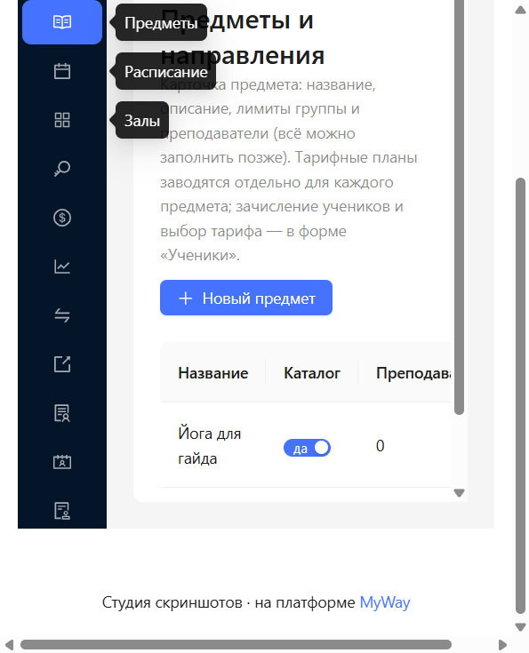

# Предметы и тарифные планы

Раздел **«Предметы»** (заголовок страницы **«Предметы и направления»**) хранит каталог направлений обучения: название, описание, лимиты группы, закреплённые преподаватели, публикация на публичном сайте, **тарифные планы** и зачисления учеников.

## Назначение

- Единый справочник для **расписания** (выбор предмета в занятии).
- Основа для **публичной витрины** (`/myway/<slug>`) и форм записи преподавателя/ученика.
- Управление **ценами за занятие** через тарифные планы (в копейках внутри системы, в формах часто вводится в рублях).

## Таблица предметов

Колонки зависят от версии; типично: название, признак активности в каталоге, действия (**изменить**, **удалить**, управление тарифами).

### Кнопка «Новый предмет»

Доступна **владельцу и администратору**. Открывает модальное окно **«Новый предмет»** / **«Редактировать предмет»**.

Поля формы карточки (основные):

- **Название** — обязательно.
- **Описание** — текст для карточки и сайта.
- **Минимум / максимум учеников** — ограничение размера группы (если используются).
- **Преподаватели** — мультивыбор членов организации, которые ведут этот предмет. От этого зависит фильтр преподавателей в расписании при выборе предмета.

Переключатель активности в каталоге (если отображается) определяет, виден ли предмет на публичных формах и в маркетинговых списках.

## Тарифные планы

У каждой строки предмета есть действие открытия модала тарифов (кнопка с иконкой **«Счёт»**).

Внутри:

- Таблица планов со статусами: **«На согласовании»**, **«Согласован»**, **«Отклонён»**.
- Кнопка **«Добавить тарифный план»** — доступна **владельцу/администратору** всегда; **преподавателю** — только если он закреплён за этим предметом.

Форма добавления:

- Название плана, описание.
- **Цена** вводится в рублях в форме; внутри конвертируется в минорные единицы.

**Владелец/администратор** может согласовать или отклонить план, созданный преподавателем.

## Зачисление учеников

В карточке предмета предусмотрен блок зачисления: выбор ученика организации и тарифного плана (если планы есть). Это связывает ученика с предметом для учёта и отображения в расписании.

---

Дальше: [04-zaly.md](./04-zaly.md).
