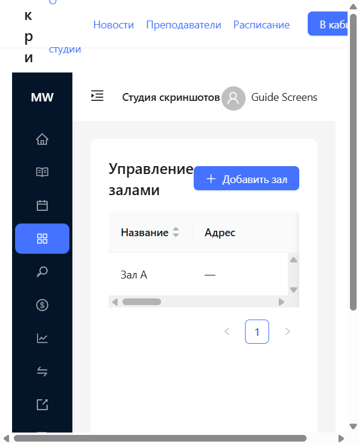

# Залы (помещения)

Раздел **«Залы»** — справочник помещений студии: название, тип, площадь, почасовая ставка, адрес, цвет для календаря.

## Назначение

- Используются в **расписании** и **фильтре «Все залы»**.
- Участвуют в **биллинге** (привязка счётчиков к помещению).
- Участвуют в **субаренде** (выбор зала для бронирования).

## Интерфейс

Заголовок **«Управление залами»**. Справа кнопка **«Добавить зал»**.

Таблица колонок (типично):

| Колонка | Содержание |
|---------|------------|
| Название | Имя зала для внутреннего использования. |
| Адрес | Текст или «—». |
| Тип | Человекочитаемый тип: «Танцевальный зал», «Зал йоги», «Спортзал», «Конференц-зал», «Другое». |
| Площадь (м²) | Число или «—». |
| Стоимость/час (₽) | Для отображения экономики и субаренды. |
| Цвет | Тег с hex — используется как fallback-цвет записей расписания. |
| Действия | **Изменить** (карандаш), **Удалить** (урна с подтверждением «Удалить зал?»). |

## Модальное окно «Новый зал» / «Редактировать зал»

Кнопки футера: **«Сохранить»**, **«Отмена»**.

Поля:

- **Название** — обязательно; плейсхолдер «Большой зал».
- **Адрес** — необязательно; подсказка про полный адрес или ориентир.
- **Тип** — обязательный выбор из списка типов.
- **Площадь (м²)** и **Стоимость/час (₽)** — числовые поля ≥ 0.
- **Описание** — текст.
- **Цвет (для расписания)** — **ColorPicker**, формат hex.

## Права

Создание, изменение и удаление залов доступны **OWNER** и **ADMIN**. Остальные роли при прямом вызове API получат отказ.

---

Дальше: [05-propusk.md](./05-propusk.md).
