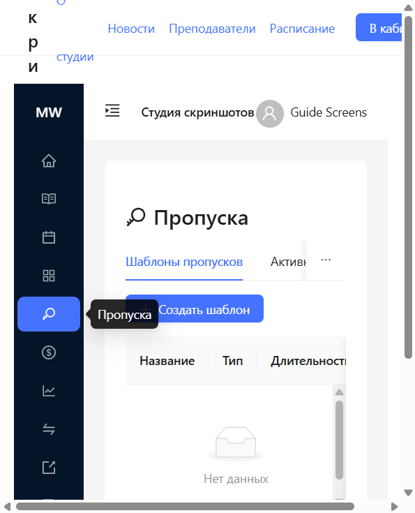
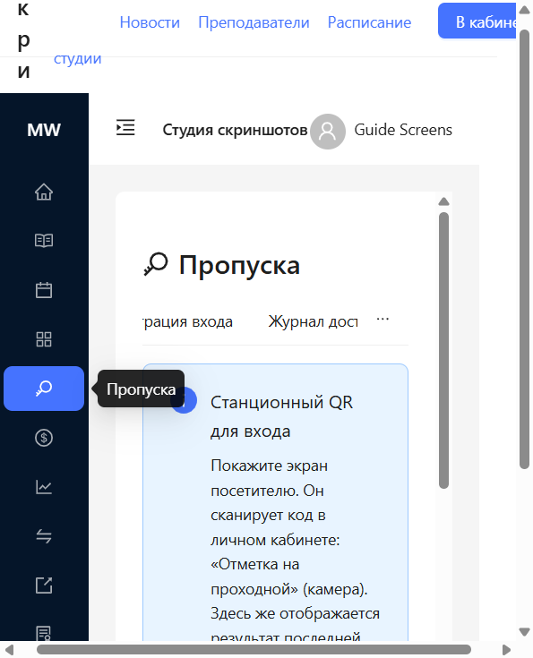

# Пропуска

Модуль **«Пропуска»** объединяет: шаблоны абонементов/разовых пропусков, выдачу пропусков людям, экран **станционного QR** для входа на ресепшене, ручную регистрацию входа и **журнал проходов**.

> Для участников без административных прав часть вкладок может быть недоступна или показывать только «свои» пропуска — см. роли.

## Вкладка «Станция / QR»

Отображается **владельцу и администратору**.

Содержимое:

- Информационный блок **«Станционный QR для входа»** — поясняет, что посетитель сканирует код в личном кабинете в разделе **«Отметка на проходной»**.
- Карточка с **QR-кодом** (`QRCodeSVG`). Под ним подпись: **«Интервал обновления ~N с · действует до ЧЧ:мм:сс»** — код меняется периодически (настройка организации: «Станционный QR: смена кода» в секундах).
- После попытки входа кратко может показываться баннер **«Доступ разрешён»** или **«Доступ запрещён»** с ФИО, шаблоном пропуска или кодом причины отказа.

## Вкладка «Шаблоны пропусков»

Кнопка **«Создать шаблон»** открывает модал **«Новый шаблон пропуска»**.

Уровни доступа (поле выбора):

- **По количеству посещений**
- **На период**
- **Разовый**

В таблице шаблонов доступны административные действия (редактирование/удаление — по версии UI).

## Вкладка «Активные пропуска»

- Памятка про QR личного пропуска (**«Подробнее»** с иконкой глаза у строки открывает карточку с QR и текстовым кодом).
- Кнопка **«Выдать пропуск»** → модал **«Выдать пропуск»**:
  - **Шаблон пропуска** — выпадающий список с подписью вида `Имя — N дн., X ₽`.
  - **Владелец** — выбор пользователя-держателя.
  - Кнопки **«Выдать»** / **«Отмена»**.

Для выданных пропусков доступны операции **заморозки**, **снятия заморозки**, **отзыва**, отметки оплаты/возврата (по контекстным кнопкам строки).

## Вкладка «Регистрация входа»

Инструменты для ресепшена: поиск по коду и ручное подтверждение входа (поток зависит от настроек доступа).

## Вкладка «Журнал доступа»

Таблица событий прохода за выбранный интервал дат (**RangePicker**). Используйте для разбора спорных ситуаций и аудита.

---

Дальше: [06-billing.md](./06-billing.md).
