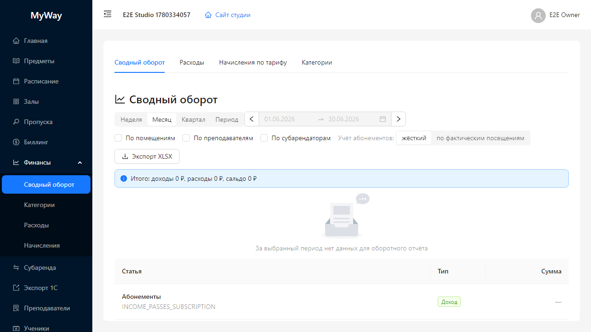

# Финансы

Подменю **«Финансы»** объединяет управленческий учёт выручки и затрат студии. Доступ определяется **активной версией платформенного тарифа** организации (feature `finance.turnoverReport` в JSON версии плана) и для роли **ADMIN** — флагом организации, который может включить только **владелец**.

## Кто видит раздел «Финансы»

| Роль | Условие |
|------|---------|
| **OWNER** | Тариф включает модуль (`finance.turnoverReport` ≠ false) |
| **ADMIN** | Тот же тариф **и** у организации включён флаг `financeReportForAdmin` (в JWT/UI приходит как `accessControl.financeReportForAdmin`) |
| **INSTRUCTOR, STUDENT, SUB_TENANT** | Пункт **«Финансы»** в меню **не показывается** |
| **SUPER_ADMIN** | Пункт отсутствует (финансы тенанта недоступны) |

Переключателя «разрешить финансы админу» в интерфейсе настроек **пока нет** — владелец меняет флаг через API `PATCH /api/organizations/{id}/access-control` с телом `{ "financeReportForAdmin": true|false }`. При появлении переключателя в UI используйте его.

## Порядок пунктов: меню и вкладки

**Боковое меню** (подменю «Финансы»): Сводный оборот → Категории → Расходы → Начисления.

**Вкладки** внутри раздела `/manage/finance/...` после перехода: **Сводный оборот** → **Расходы** → **Начисления по тарифу** → **Категории**.

## Вкладки верхнего уровня

| Вкладка | Назначение |
|---------|------------|
| **Сводный оборот** | Отчёт по выручке/себестоимости с разрезами (помещения, преподаватели, субарендаторы — в зависимости от фильтров страницы). Есть экспорт в **XLSX**. |
| **Расходы** | Учёт расходных операций; связка с категориями. |
| **Начисления по тарифу** | Начисления по тарифным планам посещений; пересчёт и помесячное подтверждение (кнопки на странице). |
| **Категории** | Справочник статей для классификации расходов и правил распределения в отчёте. |

## Работа со сводным оборотом

- Выберите **пресет периода** (неделя, месяц, квартал, произвольный диапазон) и при необходимости точные даты.
- Пресеты периода: **«Неделя»**, **«Месяц»**, **«Квартал»**, **«Период»** (произвольный диапазон в **«Начальная дата»** / **«Конечная дата»**).
- Чекбоксы группировки (**«По помещениям»**, **«По преподавателям»**, **«По субарендаторам»**) меняют разрез таблицы.
- Переключатель **«Учёт абонементов»**: **«жёсткий»** или **«по фактическим посещениям»**.
- Кнопка **«Экспорт XLSX»** выгружает текущую конфигурацию фильтров в файл.

Ниже по интерфейсу — таблицы/графики (зависят от данных организации).

## Начисления

Страница показывает строки начислений со статусами вроде **«Черновик»**, **«Начислен»**, **«Оплачен»**, **«Списан»**. Используйте фильтры по периоду и предметам.

Кнопка **«Пересчитать за период»** запускает пересчёт начислений по выбранным фильтрам. Массовые операции подтверждения месяца — по подписи кнопок на странице.

## Важно для администратора

Если пункта **«Финансы»** нет в меню, владелец не выдал право на финансовый отчёт (`financeReportForAdmin`) или тариф не включает модуль.

---

Дальше: [08-subarenda-i-eksport.md](./08-subarenda-i-eksport.md).
