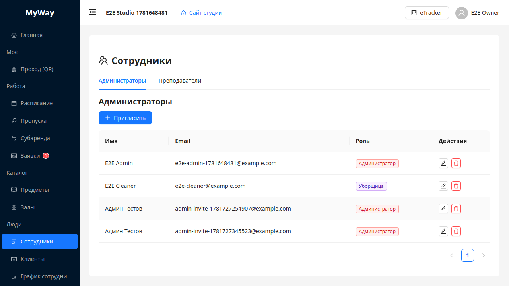
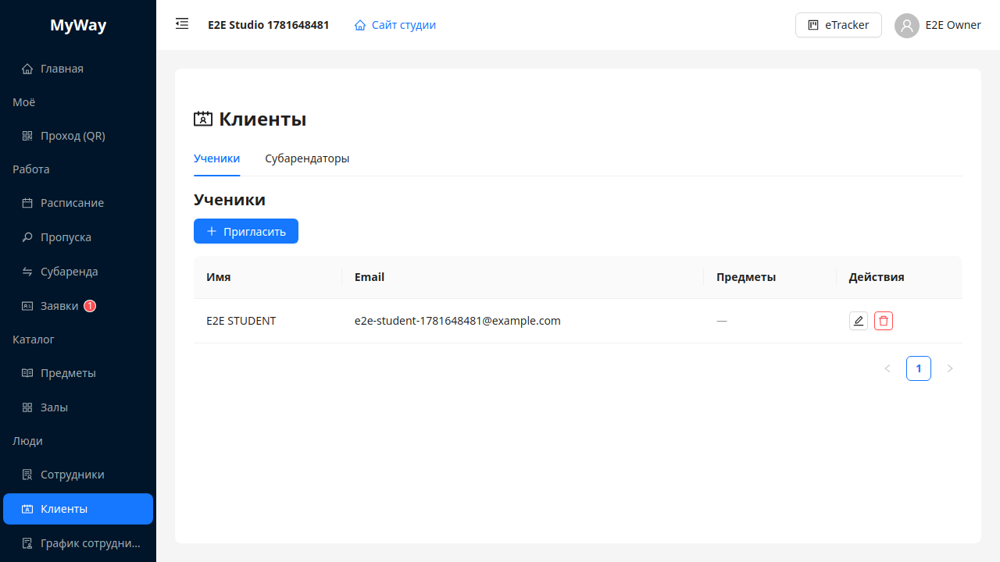
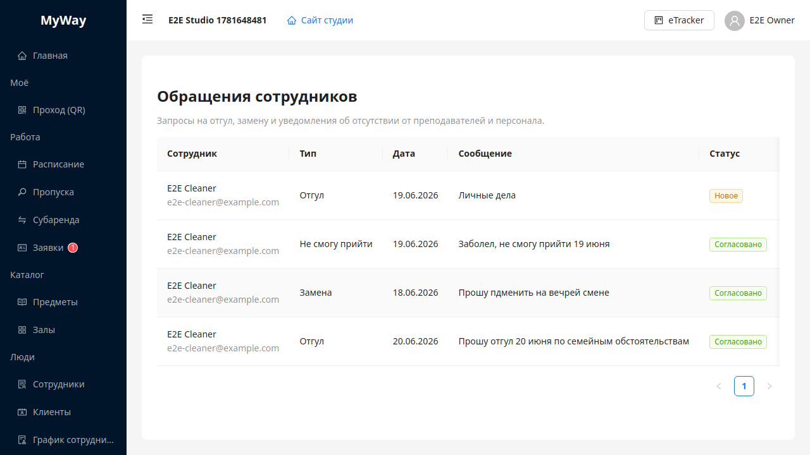

# Сотрудники, клиенты, график и обращения

Управление людьми сгруппировано в два раздела меню (группа **«Люди»**, только OWNER/ADMIN):

- **Сотрудники** — внутренние участники студии;
- **Клиенты** — внешние участники, пользующиеся услугами.

## Сотрудники (`/manage/staff`)

Страница с вкладками:

- **Администраторы** — роли **Администратор** и **Уборщица** (CLEANER);
- **Преподаватели** — роль **Преподаватель** (INSTRUCTOR).

На каждой вкладке: кнопка **«Пригласить»** (модал «Пригласить участника»: Имя, Фамилия, Email, Роль — допустимые значения зависят от вкладки), редактирование строки (карандаш), удаление (урна, подтверждение **«Удалить пользователя?»**). На вкладке «Преподаватели» доступна привязка предметов и публичный профиль.

> Управление администраторами раньше было вкладкой в «Настройках» — теперь оно здесь, на вкладке «Администраторы».

## Клиенты (`/manage/clients`)

Страница с вкладками:

- **Ученики** — роль **Ученик** (STUDENT);
- **Субарендаторы** — роль **Субарендатор** (SUB_TENANT).

Действия аналогичны: приглашение, редактирование, удаление.

Лёгкие роли (преподаватель, ученик и т.п.) разделы «Сотрудники»/«Клиенты» в меню **не видят**.

## График сотрудников

Пункт меню **«График сотрудников»** (заголовок страницы — **«График работы администраторов»**). Планирует **рабочие смены** персонала (роли **ADMIN** и **OWNER**).

- Таблица **правил** (администратор, тип повторения, интервал времени).
- **«Добавить правило»** (OWNER/ADMIN) → модал «Правило графика»: выбор сотрудника, повторение («Каждый день», «Через день», «Пн–Пт», еженедельно/раз в две недели/ежемесячно), время начала/конца смены.
- Удаление строки — **«Удалить»** с подтверждением.

Доступ на изменение правил — **OWNER** и **ADMIN**.

## Обращения сотрудников (`/manage/staff-requests`)

Пункт меню **«Обращения»** (группа «Люди», OWNER/ADMIN) с **бейджом количества новых**. Здесь администрация видит входящие запросы персонала и согласует их.

- Колонки: **Сотрудник**, **Тип** (Отгул / Замена / Не смогу прийти), **Дата**, **Сообщение**, **Статус**, **Отправлено**, действия.
- Действия по строке: **«Принять к сведению»** (новое → «Принято»), **«Согласовать»** (зелёная галочка → «Согласовано»), **«Отклонить»** (→ «Отклонено»). После обработки в строке отображается имя обработавшего.
- Бейдж в меню показывает число обращений в статусе **«Новое»** и обнуляется по мере обработки.

Сотрудник создаёт обращения в своём разделе **«Обращения»** (группа «Моё») — см. [11-lichniy-kabinet.md](./11-lichniy-kabinet.md).

---

Дальше: [10-novosti-zayavki.md](./10-novosti-zayavki.md).
