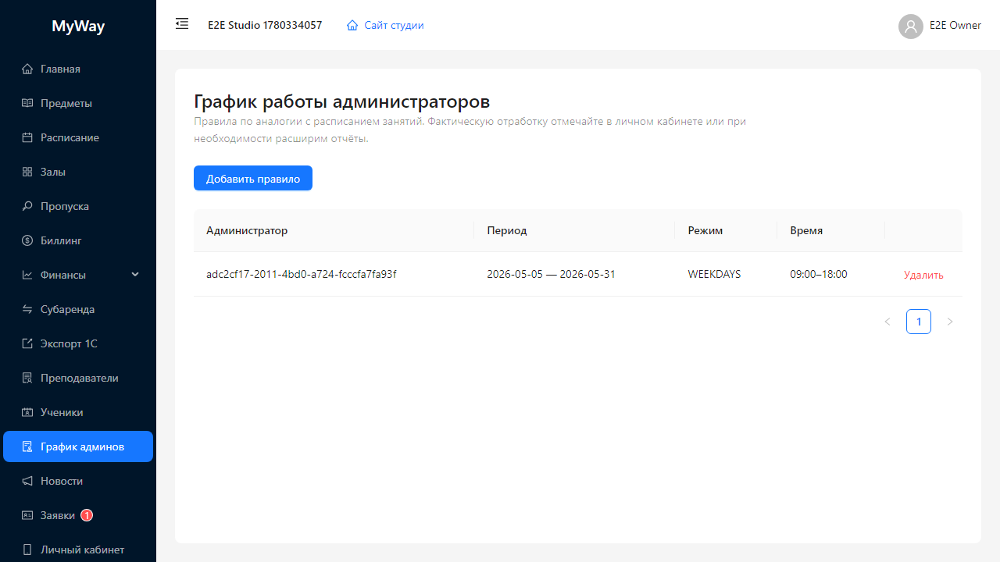

# Преподаватели, ученики и график админов

## Преподаватели

Пункт меню **«Преподаватели»** открывает каталог участников, которых студия относит к преподавательской линии (в интерфейсе приглашения доступны роли **«Преподаватель»** и **«Субарендатор»** в зависимости от контекста страницы).

### Возможности для OWNER и ADMIN

- Кнопка **«Пригласить»** → модал **«Пригласить участника»** с полями **Имя**, **Фамилия**, **Email**, **Роль** (в этом разделе по умолчанию преподаватель или субарендатор — см. доступные значения селекта).
- Редактирование строки (**иконка карандаша**): смена роли (в допустимых пределах), предметов/публичного профиля — поля формы зависят от конфигурации.
- Удаление участника (**иконка урны**) с подтверждением **«Удалить пользователя?»**.

### Карточные подсказки

Для ролей с публичным профилем доступны переключатели отображения на сайте студии (по форме редактирования).

## Ученики

Пункт **«Ученики»** — аналогичный каталог для роли **ученик**: приглашение, редактирование, удаление; без показа преподавательских полей.

## График админов

Пункт бокового меню: **«График админов»**. Заголовок страницы: **«График работы администраторов»**.

Планирует **рабочие смены административного персонала** (роли **OWNER** и **ADMIN** в организации).

Интерфейс:

- Таблица существующих **правил** (колонки: администратор, тип повторения, интервал времени и др.).
- Кнопка **«Добавить правило»** (только **OWNER/ADMIN**) открывает модал **«Правило графика»** с полями:
  - выбор **администратора** из списка членов с ролями ADMIN/OWNER;
  - **повторение**: «Каждый день», «Через день», «Пн–Пт», еженедельно по дням, раз в две недели, ежемесячно по числам;
  - время начала/конца смены (**TimePicker** / **DatePicker** — по полям формы).
- Кнопки модала: **«Сохранить»** / **«Отмена»**.

Удаление строки — ссылка **«Удалить»** с подтверждением **«Удалить правило?»**.

Персональный просмотр своих смен — в **«Личном кабинете»** → **«График работы (администратор)»** ([11-lichniy-kabinet.md](./11-lichniy-kabinet.md)).

Доступ на изменение правил: **OWNER** и **ADMIN**.

---

Дальше: [10-novosti-zayavki.md](./10-novosti-zayavki.md).
