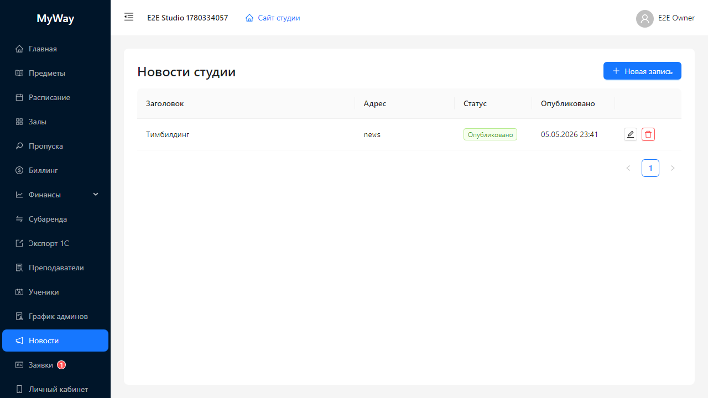
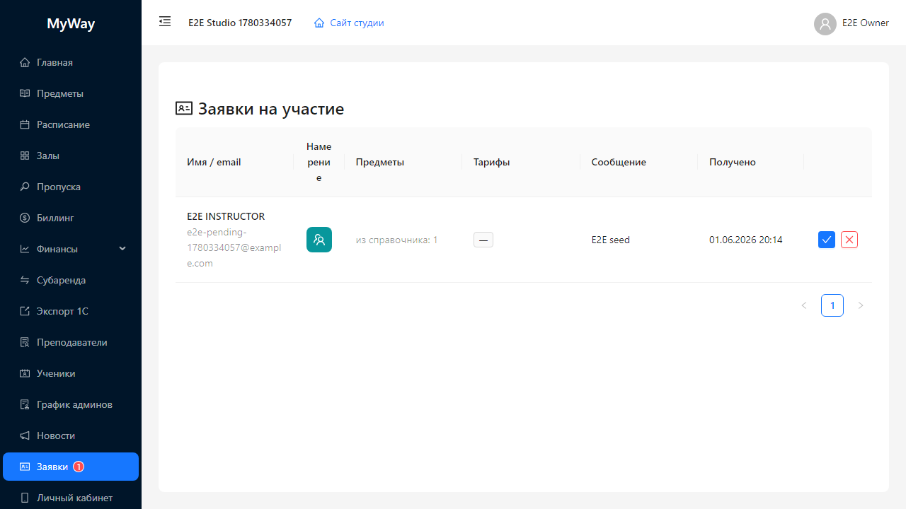

# Новости и заявки

## Новости

Раздел меню **«Новости»** открывает страницу **«Новости студии»** — управление публикациями на публичном сайте организации (`/go/<slug>/news`).

Типичный интерфейс:

- Кнопка **«Новая запись»** (с иконкой плюс) — создание материала.
- Таблица статей: **Заголовок**, **Адрес** (slug URL), статус (**Черновик**, **Опубликовано**, **В архиве**), **Опубликовано**, действия редактирования/удаления.
- Модальное окно создания/редактирования:
  - **Заголовок** (не «Тема»)
  - **Адрес (URL)** — slug с префиксом `/news/` в подсказке поля
  - **Текст (markdown)** — тело статьи
  - **Статус** — в форме для архива подпись **«Архив»**, в таблице — **«В архиве»**

После публикации материал доступен посетителям публичной витрины.

Доступ на изменение: **OWNER**, **ADMIN**.

## Заявки на участие

Страница **«Заявки на участие»** (пункт меню **«Заявки»**; при наличии необработанных заявок рядом с названием может быть **бейдж с числом** — счётчик видят только **OWNER** и **ADMIN**).

Таблица содержит колонки вроде:

- **Имя / email**
- **Намерение** — иконка **преподаватель** или **ученик** с подсказкой при наведении
- **Предметы** — из каталога и/или пользовательские названия тегами
- **Тарифы** — количество выбранных тарифных планов (для учеников)
- **Сообщение**, **Получено**
- Действия: зелёная кнопка **принять** (диалог **«Одобрить заявку?»** → **«Одобрить»**), красная **отказ** (**«Отклонить заявку?»** → **«Отклонить»**).

Источник заявок — публичные формы **«Хочу преподавать в студии»** и **«Хочу учиться в студии»**.

Доступ на одобрение/отклонение: **OWNER**, **ADMIN** (остальные роли при открытии URL увидят страницу без кнопок действий или получат отказ API).

---

Дальше: [11-lichniy-kabinet.md](./11-lichniy-kabinet.md).
