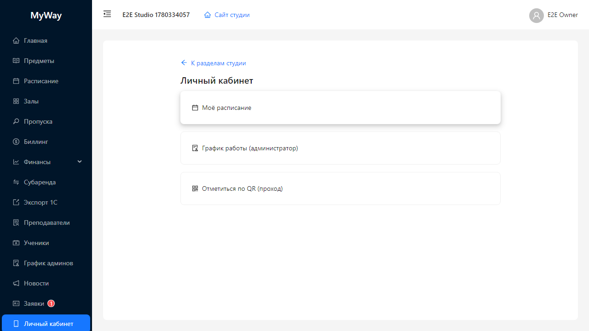

# Личный кабинет

Пункт меню **«Личный кабинет»** ведёт на префикс `/manage/me`. Это **персональные** функции: своё расписание, график работы администратора (если применимо), отметка прохода по QR.

## Главная личного кабинета (`/me`)

Карточки-ссылки (зависят от роли):

| Карточка | Кому показывается |
|----------|-------------------|
| **Моё расписание** | **OWNER**, **ADMIN**, **INSTRUCTOR**, **STUDENT** |
| **График работы (администратор)** | **OWNER**, **ADMIN** |
| **Отметиться по QR (проход)** | **все роли**, включая **SUB_TENANT** |

У **субарендатора (SUB_TENANT)** на главной `/me` отображается **только** карточка **«Отметиться по QR (проход)»** — без «Моё расписание».

## Моё расписание (`/me/schedule`)

Компактное представление занятий пользователя как участника (фильтрация на стороне API по роли: преподаватель видит свои слоты преподавания, ученик — свои занятия).

## График работы (`/me/work`)

Если пользователь **не** ADMIN/OWNER, при переходе отображается текст: **«Раздел доступен администраторам и владельцу.»**

Для администратора и владельца — персональное представление графика смен (связано с правилами на странице **«График работы администраторов»**).

## Отметка на проходной (`/me/scan`)

Заголовок **«Отметка на проходной»**.

### Блок «Станционный QR»

- Область под камеру (`gate-qr-reader`).
- **«Запустить камеру»** — запрос доступа к камере браузера; при успехе сканирование QR со стойки ресепшена.
- **«Остановить»** — остановка камеры.

После успешного сканирования — зелёное уведомление **«Вход зарегистрирован»** (или текст с сервера).

Типичные сообщения об отказе (по коду `denyCode`):

| Ситуация | Текст в интерфейсе |
|----------|-------------------|
| Просроченный/неверный QR | **«Код недействителен или устарел. Попросите обновить QR на ресепшене.»** |
| Нет пропуска | **«Нет активного пропуска для этой студии.»** |
| Нет занятия в окне | **«Нет занятия в допустимом окне расписания.»** |
| Роль не поддерживается | **«Этот тип аккаунта не может войти через станционный QR.»** |
| Нет членства в студии | **«Нет доступа к этой студии.»** |
| Нет залов | **«Не настроены залы для регистрации прохода — обратитесь к администратору.»** |

При частых попытках возможна ошибка **429** — **«Слишком много попыток. Подождите минуту.»**

### Блок «личный пропуск»

Разделитель **«или личный пропуск»**.

- Поле **«Токен QR личного пропуска»** — вставить строку из карточки пропуска (вкладка **«Активные пропуска»** → **«Подробнее»** у строки).
- Кнопка **«Отметиться»** — check-in по токену; успех **«Посещение зарегистрировано»**.

---

Дальше: [12-nastroiki.md](./12-nastroiki.md).
