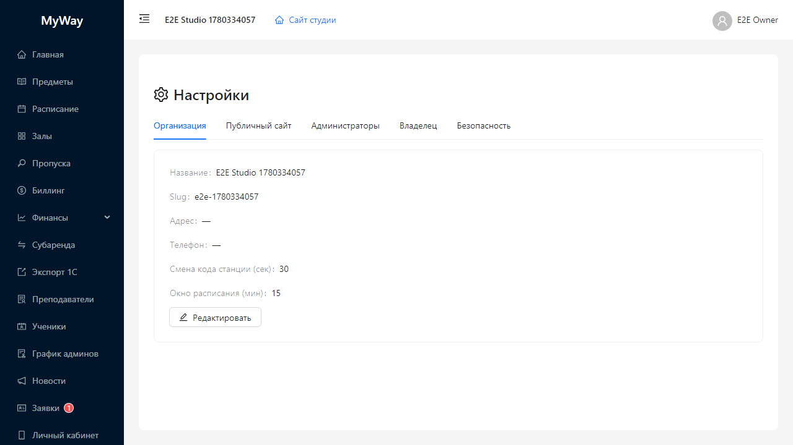
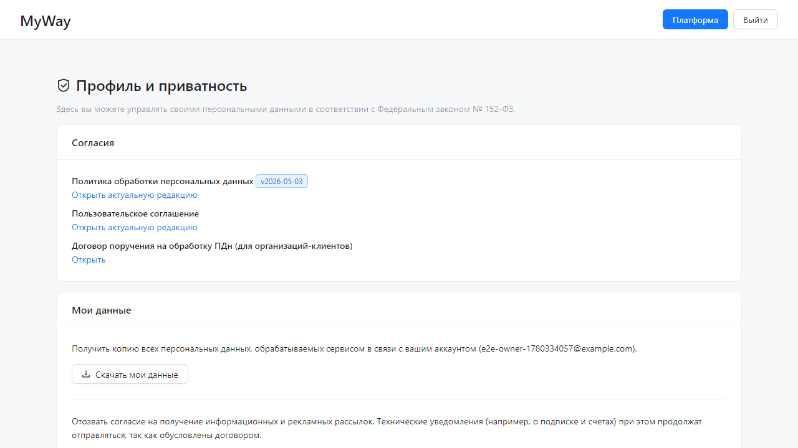

# Настройки

Страница **«Настройки»** (`/go/<slug>/manage/settings`) — вертикальные вкладки с параметрами организации и профиля.

> **SUPER_ADMIN** / **SUPER_USER** в контексте чужого тенанта видят **только вкладку «Безопасность»** (смена пароля). Профиль оператора — на **«Платформа» → «Профиль»**. Остальные вкладки студии скрыты — см. [14-platforma-super-admin.md](./14-platforma-super-admin.md).

## Вкладка «Организация»

Режим просмотра: карточка с полями **Название**, **Slug**, **Адрес**, **Телефон**; для **OWNER/ADMIN** дополнительно **Станционный QR: смена кода (сек)** и **Окно расписания для ученика/преподавателя (±мин)** — см. [05-propusk.md](./05-propusk.md) и [02-raspisanie-podrobno.md](./02-raspisanie-podrobno.md).

Кнопка **«Редактировать»** (иконка карандаша) переводит в форму:

- **Название** — обязательно.
- **Станционный QR: смена кода (сек)** — число 10–300.
- **Окно расписания для ученика/преподавателя (±мин)** — 5–120.

**«Сохранить»** / **«Отмена»**.

Права на изменение технических полей — **OWNER** и **ADMIN**.

## Вкладка «Публичный сайт»

Форма визитки студии на `/go/<slug>`:

- **Описание студии**
- Контакты: телефон, email, адрес
- **Соцсети (JSON)** — структурированная строка для ссылок
- Переключатель **«Заявки требуют подтверждения»** — если включён, новые публичные регистрации попадают в **«Заявки»** со статусом ожидания.

Кнопка сохранения обновляет публичную страницу.

## Вкладка «Администраторы»

Встроенный список пользователей с ролью администратор: приглашение, редактирование, удаление.

## Вкладка «Владелец»

Карточка единственного владельца организации: ФИО, email, тег роли **«Владелец»**. Редактирование через форму (**«Редактировать»**) обновляет контактные данные владельца.

## Вкладка «Безопасность»

Форма смены пароля:

- **Текущий пароль**
- **Новый пароль** (минимум 8 символов)
- **Подтверждение нового пароля**

Кнопки **«Сменить пароль»**, **«Очистить»**.

## Профиль и приватность (`/go/account/privacy`)

Отдельная страница (пункт меню пользователя **«Профиль и приватность»**), не вкладка настроек организации. Заголовок: **«Профиль и приватность»**.

### Карточка «Согласия»

Ссылки на актуальные документы:

- **Политика обработки персональных данных** (с тегом версии, например `v1`)
- **Пользовательское соглашение**
- **Договор поручения на обработку ПДн** (для организаций‑клиентов)

### Карточка «Мои данные»

| Действие | Кнопка | Примечание |
|----------|--------|------------|
| Экспорт ПДн | **«Скачать мои данные»** | JSON-файл `myway-account-export-…json` |
| Отзыв маркетинга | **«Отозвать маркетинговое согласие»** | Технические уведомления по договору остаются |
| Удаление аккаунта | **«Удалить аккаунт»** | Модал **«Подтверждение удаления»**: ввести email, опционально **причину**; кнопки **«Удалить»** / **«Отмена»** |

Для ролей **OWNER** и **SUPER_ADMIN** кнопка удаления **неактивна**; показывается предупреждение связаться с поддержкой (владелец не может удалить себя через UI, пока является владельцем организации).

## Меню пользователя (шапка)

Быстрые переходы без вкладок настроек:

- **Организация** / **Владелец** / **Преподаватели** / **Ученики** — см. [01-layout-i-menu.md](./01-layout-i-menu.md)
- **Профиль и безопасность** → `/manage/settings?tab=security`
- **Профиль и приватность** → `/go/account/privacy`
- **Выйти**

---

Дальше: [13-obratnaya-svyaz.md](./13-obratnaya-svyaz.md).
