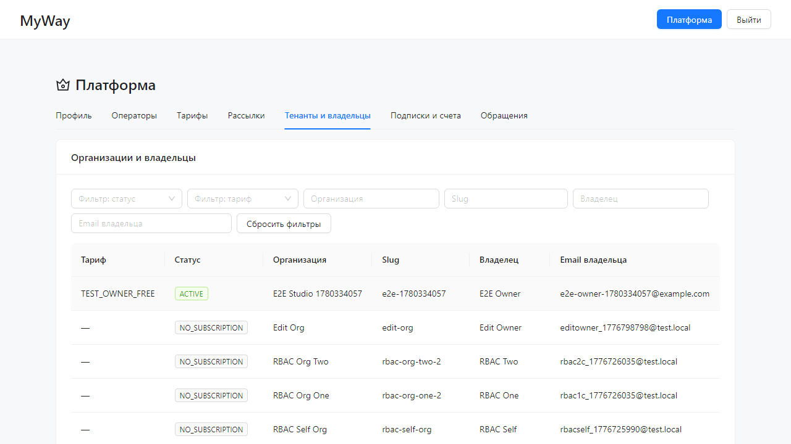

# Платформа (роли SUPER_ADMIN и SUPER_USER)

Раздел **`/go/platform`** доступен пользователям с ролью **SUPER_ADMIN** или **SUPER_USER**. Это **не** кабинет студии: здесь управление всеми организациями-подписчиками платформы, тарифами и рассылками.

> **Адреса URL:** в продакшене и пилоте используется префикс **`/go`**. Старые ссылки вида `/myway/...` перенаправляются на `/go/...` автоматически.

| Роль | Возможности |
|------|-------------|
| **SUPER_ADMIN** | Полный доступ; вкладка **«Операторы»** — создание пользователей с ролью **SUPER_USER**. |
| **SUPER_USER** | Те же разделы (тенанты, тарифы, подписки, рассылки, обращения), **без** вкладки «Операторы» и без API создания операторов. |

Заголовок страницы: **«Платформа»**. В футере страниц входа и кабинета отображается **версия продукта** и build-stamp (данные `GET /api/public/build-info`).

## Вкладки на `/go/platform`

Переключение вкладок сохраняется в URL (`?tab=...`). **По умолчанию** открывается вкладка **«Тенанты и владельцы»**. Порядок в интерфейсе:

| Вкладка | Кто видит | Содержание |
|---------|-----------|------------|
| **Тенанты и владельцы** | все операторы | Таблица организаций с метриками активности, фильтры, сортировка. См. [раздел ниже](#тенанты-и-владельцы). |
| **Профиль** | все операторы | Email, имя, фамилия, телефон; смена пароля (без перехода в настройки тенанта). |
| **Операторы** | только SUPER_ADMIN | Список операторов; форма **«Добавить SUPER_USER»** (email, имя, фамилия, опционально пароль ≥ 8 символов). |
| **Тарифы** | все операторы | Каталог планов и **версии** условий (цена, лимиты, даты вступления). См. [раздел «Тарифы и версии»](#тарифы-и-версии) ниже. |
| **Рассылки** | все операторы | Черновики email/in-app кампаний владельцам по кодам тарифов. См. [раздел «Рассылки»](#рассылки) ниже. |
| **Подписки и счета** | все операторы | Выбор организации; назначение подписки; счета платформы. См. [раздел «Подписки»](#подписки-и-счета). Справочник планов: [platform-subscription-plans.md](../../platform-subscription-plans.md). |
| **Обращения** | все операторы | Очередь тикетов; смена статуса в строке таблицы. Коды: `OPEN`, `IN_PROGRESS`, `RESOLVED`, `CLOSED`. |

Статусы подписок в таблице тенантов: **`TRIAL`**, **`ACTIVE`**, **`EXPIRED`**, **`CANCELED`**, **`NO_SUBSCRIPTION`**, **`INACTIVE`**.

## Тенанты и владельцы

Карточка **«Организации и владельцы»**. Список **отсортирован по индексу активности** (учитываются недавние входы в систему, проходы через контроль доступа и число пользователей).

Фильтры: **статус**, **тариф**, **Организация**, **Slug**, **Владелец**, **Email владельца**; кнопка **«Сбросить фильтры»**.

Колонки таблицы:

| Колонка | Смысл |
|---------|--------|
| **Активность** | Сводный индекс (подсказка в заголовке колонки) |
| **Пользователей** | Число участников в студии |
| **Входов в систему** | Всего успешных login; подпись «*N* за 24 ч» |
| **Проходов** | Всего проходов через контроль доступа; подпись «*N* за 24 ч» |
| **Данные** | Объём в МБ и доля лимита БД |
| **Тариф** | Код плана подписки или «—» |
| **Статус** | Тег подписки (`TRIAL`, `ACTIVE`, …) или `INACTIVE` |
| **Организация**, **Slug**, **Владелец**, **Email владельца** | Идентификация студии |

Пагинация: 15 строк на страницу (можно изменить).

## Тарифы и версии

Вкладка **«Тарифы»** управляет **версиями** записей в справочнике `platform_subscription_plan_versions` (миграция V43). У каждого кода плана (`START`, `PRO`, …) в один момент времени ровно одна версия в статусе **ACTIVE**.

### Справочник планов

Таблица **«Справочник тарифов»**: колонки **Код**, **Название**, **ACTIVE** (номер версии и цена ₽/мес). Клик по **коду** открывает блок версий выбранного плана.

### Таблица версий

Колонки: **Версия**, **Статус**, **С** / **По** (`effective_from` / `effective_to`), **₽/мес**, **Орг.** (число подписчиков на этой версии), **Действия**.

| Статус | Смысл | Действия в UI |
|--------|--------|----------------|
| `DRAFT` | Черновик новых условий | **Изменить** (цена, макс. пользователей), **Запланировать** |
| `SCHEDULED` | Вступит в силу с даты | **Черновик рассылки** (переход на вкладку «Рассылки»), **Отменить** |
| `ACTIVE` | Действующие условия | Только просмотр; редактирование — через новый черновик |
| `ARCHIVED` | Заменена новой ACTIVE | Только просмотр |

Кнопка **«Новая версия из ACTIVE»** копирует текущую ACTIVE-версию в **DRAFT**.

**Запланировать:** модал **«Запланировать версию»** — поле **«Дата вступления (MSK)»** (не раньше завтрашнего дня по календарю платформы) и чекбокс **«Перевести всех подписчиков на новую версию с даты»** (`migrateAllSubscribers`). После планирования статус → `SCHEDULED`.

**Активировать запланированные (job):** ручной запуск job, который переводит все `SCHEDULED` с `effective_from ≤ сегодня` в **ACTIVE**, архивирует прежнюю ACTIVE той же даты. На пилоте job также может выполняться по расписанию на сервере.

При активации новой версии с **migrate all** все подписки организаций на этот план переводятся на новую `plan_version_id`.

## Рассылки

Вкладка **«Рассылки»** — кампании `platform_broadcast_campaigns` (миграция V44).

### Создание черновика

Карточка **«Новая рассылка (черновик)»**:

- **Название**, **Тема письма**, **Текст** (плейсхолдер `{orgName}` для имени студии).
- **Тарифы (коды)** — теги с кодами планов (`START`, `PRO`, …); аудитория **PLAN_CODE**.
- Кнопки **«Создать черновик»** / **«Сохранить черновик»** (при редактировании).

Каналы при отправке: **in-app** (сообщение на главной владельца) и **email** (если настроена почта на стенде).

### Кампании

Таблица: название, тема, **статус** (`DRAFT`, `SENT`, …), число получателей. Для `DRAFT`: **Править**, **Отправить**.

Со вкладки **«Тарифы»** у версии в статусе `SCHEDULED` ссылка **«Черновик рассылки»** открывает эту вкладку для подготовки уведомления об изменении условий.

## Подписки и счета

1. Выберите организацию в поле **«Выберите организацию»**.
2. Блок **«Назначение подписки»**:
   - Текущий план и **номер версии** (`vN`), если подписка есть.
   - Если организация на **устаревшей** версии плана (не совпадает с ACTIVE каталога), показывается оранжевый тег **«Версия тарифа vN (не актуальная)»** и кнопка **«Перевести на ACTIVE»** (политика C: без смены кода плана, только `plan_version_id`).
   - Поля: **План**, переключатели **Trial** / **Test owner**, даты, **override price**; сохранение назначает подписку и привязывает к **ACTIVE**-версии выбранного плана.
3. Таблица **счетов** платформы: **«Отметить оплачено»** для неоплаченных. Для `TEST_OWNER_FREE` / Test owner коммерческие счета **запрещены** API — см. [platform-subscription-plans.md](../../platform-subscription-plans.md).

При **регистрации** новой студии подписка назначается автоматически (по умолчанию план **`TEST_OWNER_FREE`**, ACTIVE-версия).

## Рабочая область организации под оператором платформы

Если открыть `/go/<slug>/manage`, боковое меню **укорочено**:

- **Главная** — **«Панель платформы»** (не дашборд студии): вкладки **«Обзор»** и **«Все тенанты»**.
- **Платформа** — переход на `/go/platform`.
- **Обратная связь** — форма тикета.

### Вкладка «Обзор»

- Карточки: тенанты, участники в студиях, учётные записи в `users`, входы за сутки, использование БД.
- **Top-10 тенантов по входам за сутки**.

### Вкладка «Все тенанты»

Колонки: тенант, регистрация, владелец, пользователей, объём (МБ / % лимита), размер (Гб), статус, **Действия**:

- **Сообщение** — модал «Тема» / «Сообщение» → у владельца на **«Главной»**.
- **Блокировать** — **SOFT** / **HARD**, причина.
- **Разблокировать** — если тенант заблокирован.

**Финансы** студии (`/manage/finance/...`) для оператора платформы **недоступны**.

## Шапка платформы (`/go/login`, `/go/register`, `/go/platform`, …)

На страницах с layout платформы (не внутри кабинета студии) в шапке **MyWay**:

| Элемент | Когда виден |
|---------|-------------|
| **eTracker** | После входа |
| **Панель** | Оператор платформы на `/go/platform` — переход в **«Панель платформы»** (`/go/<slug>/manage/dashboard`) |
| **Админка** (основная кнопка) | Оператор **не** на `/go/platform` — переход на `/go/platform` |
| **Кабинет** | Участник организации (не оператор) — переход в дашборд студии |
| **Выйти** | После входа |

На `/go/platform` кнопка **«Админка»** скрыта (вы уже в админке платформы).

## Меню пользователя (шапка кабинета студии)

Для SUPER_ADMIN / SUPER_USER в контексте тенанта:

- **Платформа**
- **Профиль и безопасность** → `/go/<slug>/manage/settings?tab=security` (только смена пароля)
- **Профиль и приватность** → `/go/account/privacy`
- **Выйти**

Быстрых ссылок «Организация», «Преподаватели», «Ученики» **нет**.

## Настройки в контексте тенанта

На `/go/<slug>/manage/settings` у оператора платформы — только **«Безопасность»** (смена пароля). Профиль оператора удобнее менять на **«Платформа» → «Профиль»**. Вкладки организации, публичного сайта и списков участников скрыты.

---

Вернитесь к оглавлению: [README.md](./README.md).
