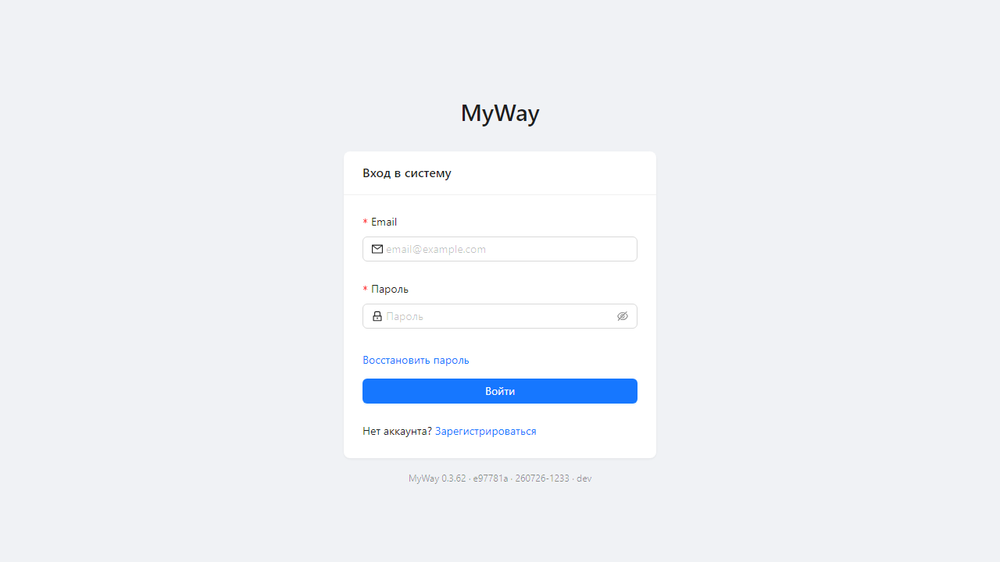
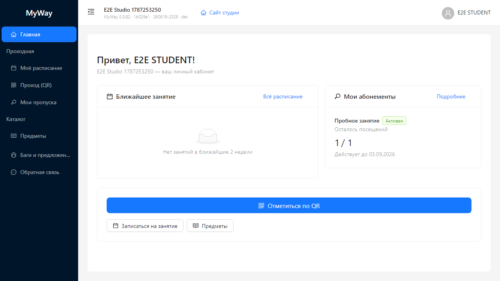

# Руководство студента

Вы — **STUDENT**. Работаете только на сайте своей студии: `/go/<slug>`. Платформа MyWay и кабинет владельца вам не нужны.

Другие роли: [оглавление](./README.md).

## Как попасть в студию

- Запись: `/go/<slug>/join/student`. Если включено подтверждение, администрация одобрит заявку в **Клиенты → Заявки**.
- Или приглашение / уже есть аккаунт: кнопка **«Войти»** на витрине → `/go/<slug>/login`.

После входа — личная **Главная**, не админ-панель.

## Меню

| Группа | Пункты |
|--------|--------|
| | **Главная** |
| **Проходная** | Моё расписание, Проход (QR), Мои пропуска |
| **Каталог** | Предметы (только смотреть) |
| | Баги и предложения, Обратная связь |

**Главная:** ближайшее занятие, абонементы (остаток дней/визитов), лист ожидания, **«Записаться на занятие»**, QR. Если у вас дети в семье студии — карточка **«Семья»** и выбор **«Смотреть как ребёнок»** (расписание и пропуска ребёнка).

На телефоне — **Главная**, **Моё расписание**, **Проход (QR)**, **Мои пропуска**.

Студийного **«Расписания»**, залов, финансов, кадров и настроек в меню нет. Чужой URL отправит на Главную.

## Моё расписание и проход

**Моё расписание** — ваши занятия, без кнопок создания.

**Проход (QR)** — **«Отметка на проходной»**: камера на станционный QR или токен из пропуска.

## Мои пропуска

Только ваши абонементы (активен / ожидает оплаты / истёк…). Шаблонов, журнала и станции нет. Купить абонемент можно с витрины студии, если студия это включила; оплату подтверждает администрация.

## Предметы

Справочник для чтения: название, направление, возраст. Без создания и тарифов.

## Обратная связь и данные

Чат с **владельцем студии**. Баги — **«Баги и предложения»**.

**Профиль и приватность:** скачать мои данные, отозвать маркетинг, удалить аккаунт.

[Оглавление](./README.md)
