# Руководство владельца студии

Вы — **OWNER**: полный кабинет студии. Сайт студии — ваш рабочий адрес; лендинг платформы MyWay для ежедневной работы не нужен.

Другие роли: [оглавление](./README.md).

## Вход и регистрация студии

Публичная страница: `/go/<slug>`. Вход: кнопка **«Войти»** → `/go/<slug>/login`. Кабинет: `/go/<slug>/manage/...`.

Над формой крупный заголовок — **название студии** (пока грузится визитка, может мелькнуть slug). Это не бренд платформы «MyWay»: «MyWay» стоит только на входе оператора `/go/login`. Карточка формы: **«Вход в систему»**, поля **Email**, **Пароль**, кнопка **«Войти»**.

После входа — `/go/<slug>/manage/dashboard`.

Новую студию создают на `/go/register` (**«Регистрация студии»**): имя, email, пароль (≥ 8), название студии, необязательный slug, согласия. Вы становитесь владельцем; назначается платформенная подписка (по умолчанию `TEST_OWNER_FREE`).

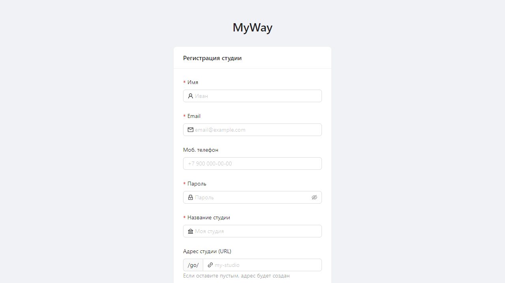

Префикс **`/go`**. Старые `/myway/...` перенаправляются сюда.

## Кабинет и меню

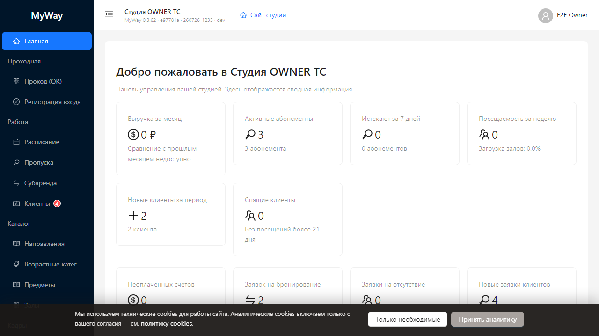

Шапка: сворачивание меню, название студии, **eTracker**, аватар.

Меню аватара: **Организация**, **Владелец**, **Профиль и безопасность**, **Профиль и приватность**, **Выйти**.

### Боковое меню (десктоп)

| Группа | Ваши пункты |
|--------|-------------|
| | **Главная** |
| **Проходная** | Проход (QR), Регистрация входа |
| **Работа** | Расписание, Пропуска, Субаренда, Клиенты |
| **Каталог** | Направления, Возрастные категории, Предметы, Залы |
| **Кадры** | Сотрудники, Заявки на отсутствие |
| **Финансы** | Сводная ведомость, Абонементы, Доходы, Расходы, Коммуналка и счётчики, Категории, Экспорт 1С *(если тариф разрешает оборот)* |
| **Студия** | Новости, Отзывы |
| | Настройки, Баги и предложения, Обратная связь |

На телефоне — нижняя панель и **«Ещё»**. Скрыты на мобильном: финансы, клиенты, кадры, новости, отзывы.

**Главная:** KPI, быстрые действия **«Новое занятие»**, **«Продать абонемент»**, **«Регистрация входа»**, **«Создать бронирование»**. Блок **«Связь с поддержкой»** (тема, сообщение, таблица переписки) — только у владельца.

## Расписание

Пункт **«Расписание»** (группа **«Работа»**). Планирование залов: занятия, аренда, обслуживание, блокировки. Для типа **«Занятие»** — вкладка **«Факт посещаемости»**. Вы можете **удалять** записи.

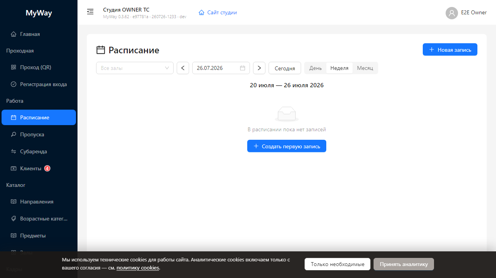

**«Новая запись»**. Фильтры: зал, стрелки периода, дата, **«Сегодня»**, виды **День / Неделя / Месяц**. Клик по пустому слоту создаёт запись на этот час; клик по блоку — редактирование.

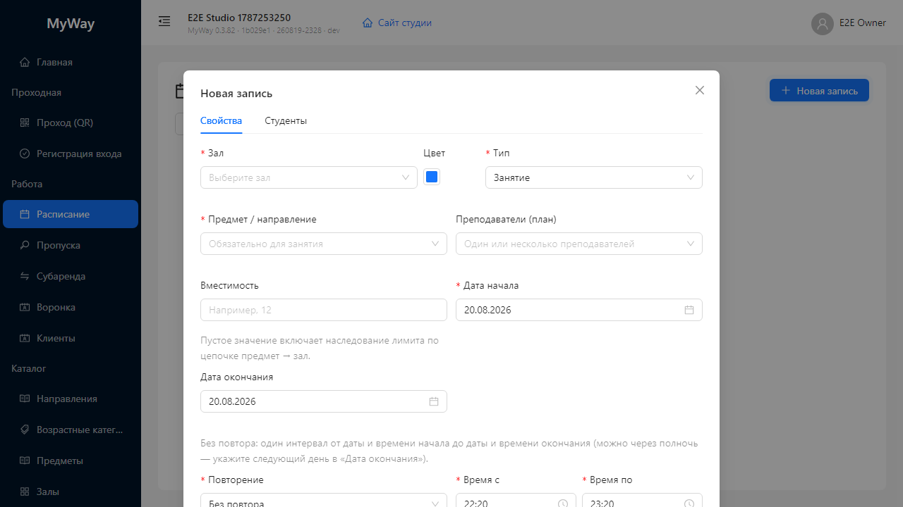

Вкладка **«Свойства»**: зал, цвет, тип (Занятие / Аренда / Обслуживание / Заблокировано), предмет (для занятия), название (для остальных), даты, повторение, время, заметки. Вкладка **«Ученики»** — состав группы. **«Создать»** / **«Сохранить»**. **«Удалить»** — только владелец и администратор.

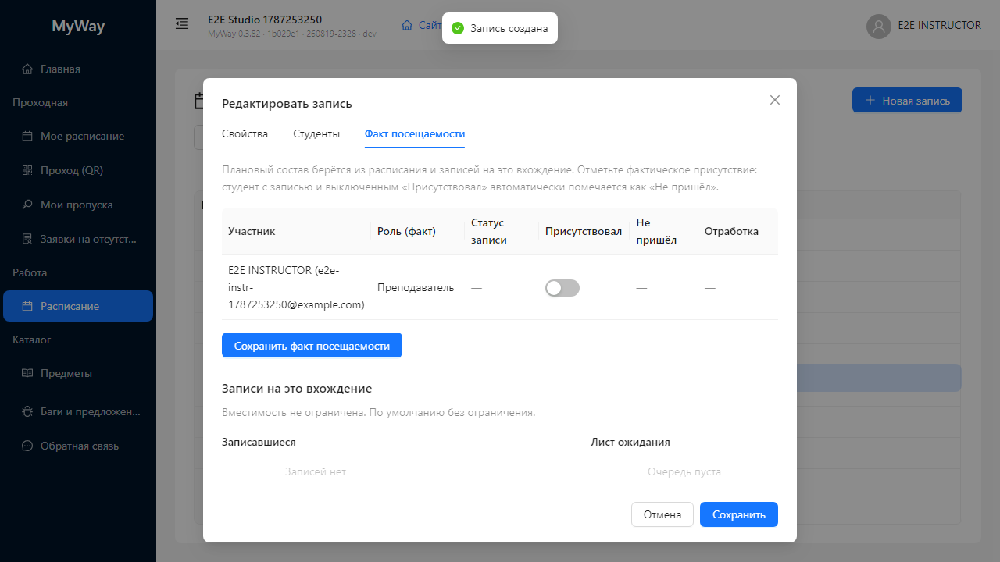

## Каталог: направления, возраст, предметы

**Поурочных тарифов у предмета нет.** Цены — в **«Финансы → Абонементы»**.

- **Направления** — справочник с HTML-описанием для витрины.
- **Возрастные категории**.
- **Предметы** — название, направление, возраст, мин/макс студентов, переключатель **«Каталог»**, HTML-описание.

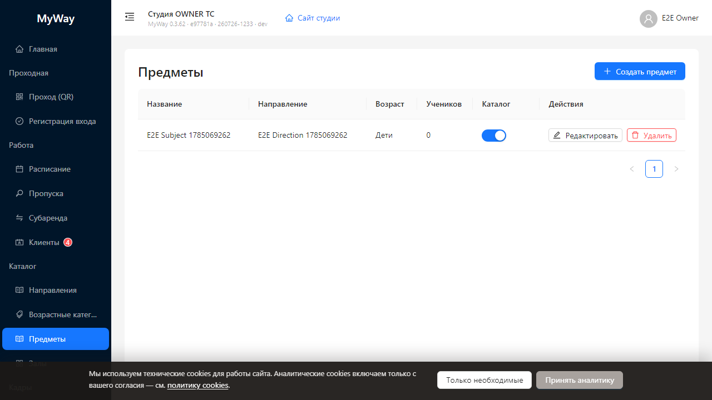

**«Создать предмет»**. В строке: редактировать, удалить. Кнопок «тарифные планы» и «зачисление» нет.

## Помещения и залы

Пункт **«Залы»** → страница **«Помещения и залы»**. Сначала помещение, внутри — залы.

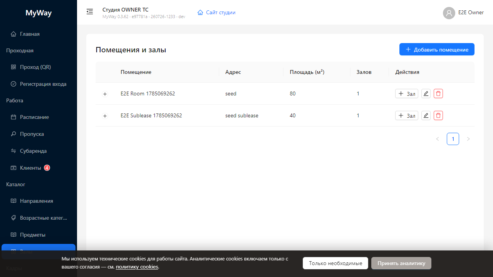

**«Добавить помещение»**: название, адрес, общая площадь, описание. В строке: **«Зал»**, изменить, архивировать (вместе с залами).

Зал: название, тип, площадь, стоимость/час, цвет для расписания, высота потолков, оборудование, интерьер, описание. Можно копировать и переносить. Последний активный зал в помещении архивировать нельзя. Архив — **«Восстановить»**.

## Пропуска, абонементы и вход

| Пункт | Где | Зачем |
|-------|-----|--------|
| **Абонементы** | Финансы | Шаблоны и продажа |
| **Пропуска** | Работа | Выданные, оплата броней, журнал |
| **Регистрация входа** | Проходная | Ресепшн и станционный QR |
| **Проход (QR)** | Проходная | Отметиться самому |

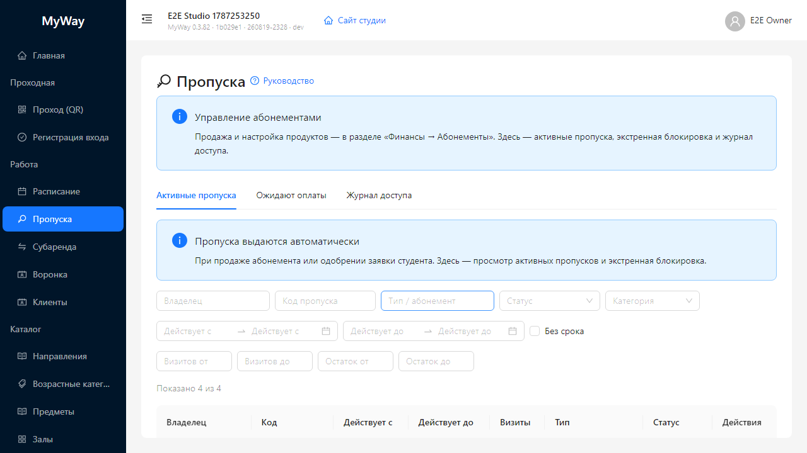

**Абонементы:** **«Создать абонемент»** — разовое посещение / пакет / безлимит, политика доступа. **«Запустить»**, **«Продать абонемент»**.

**Пропуска:** активные (блокировка), ожидают оплаты (**«Подтвердить оплату»**), журнал.

**Регистрация входа** (`/manage/gate`): QR посетителя и станционный QR. Интервал смены кода — в настройках организации.

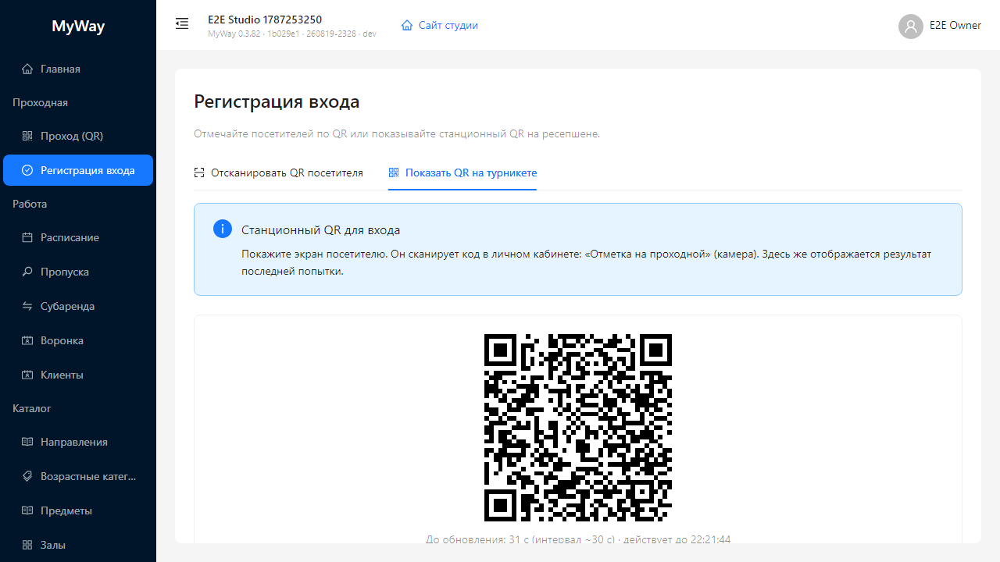

## Клиенты и кадры

**Клиенты** (Работа): вкладки **Студенты** / **Субарендаторы**, на каждой — **Зарегистрированные** / **Заявки**. Бейдж — необработанные заявки.

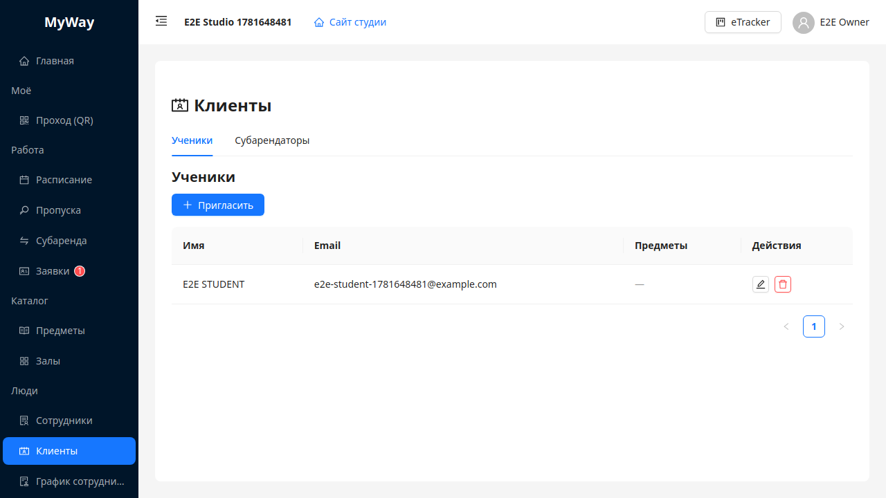

**Сотрудники** (Кадры): Администраторы, Клинер, Преподаватели, Заявки преподавателей, График работы, Календарь отсутствий.

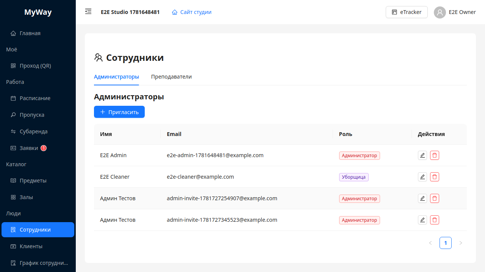

**«Пригласить»** на новый email шлёт временный пароль; первый вход — смена пароля. Смена email staff снова шлёт пароль. **«Сбросить пароль»** — на текущий email.

**Заявки на отсутствие** (Кадры): отгул / замена / не смогу прийти. **Принять к сведению**, **Согласовать**, **Отклонить**.

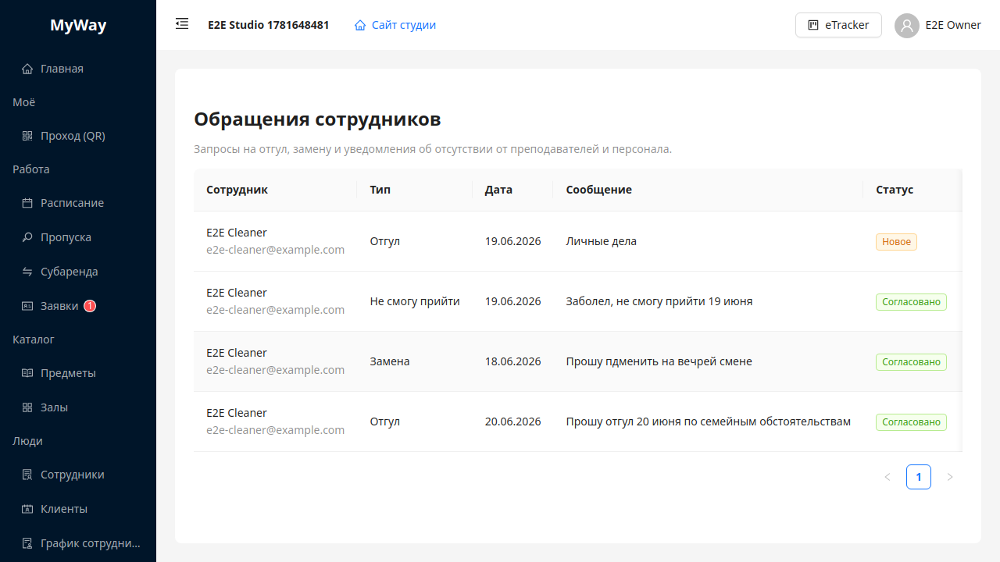

График смен — вкладка **«График работы»** у сотрудников (проход клинера «по графику» опирается на эти правила).

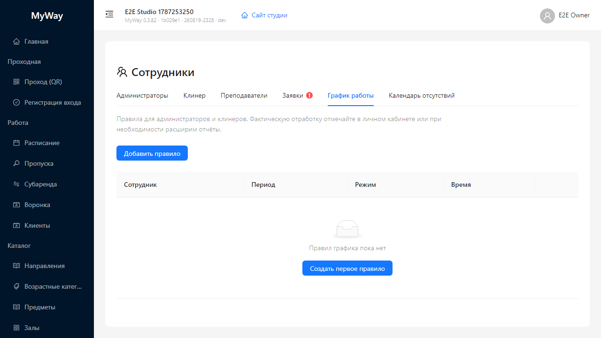

## Новости, отзывы, заявки с сайта

**Новости** (Студия): **«Новая запись»**, статусы Черновик / Опубликовано / В архиве.

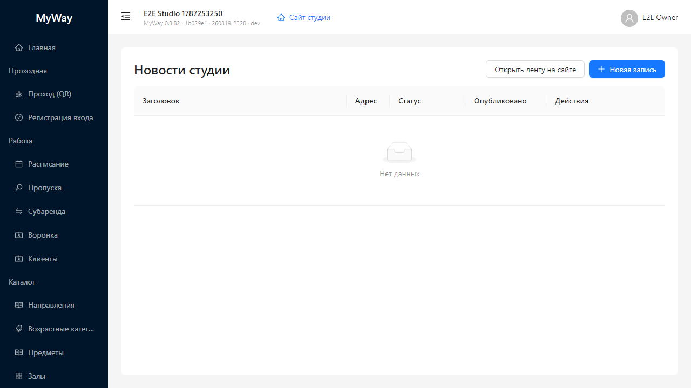

**Отзывы** — модерация отзывов с витрины.

Заявки с публичных форм:

| Откуда | Куда |
|--------|------|
| `/go/<slug>/join/instructor` | Сотрудники → Заявки |
| `/go/<slug>/join/student` | Клиенты → Студенты → Заявки |

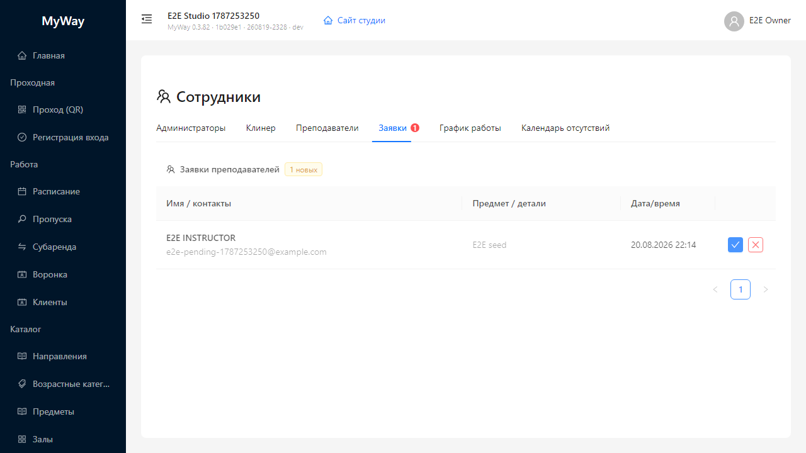

## Субаренда

Пункт **«Субаренда»** (Работа). Вкладки доступности и счетов. Вы подтверждаете брони, выставляете счета, принимаете оплату. Счета также из **Финансы → Доходы**.

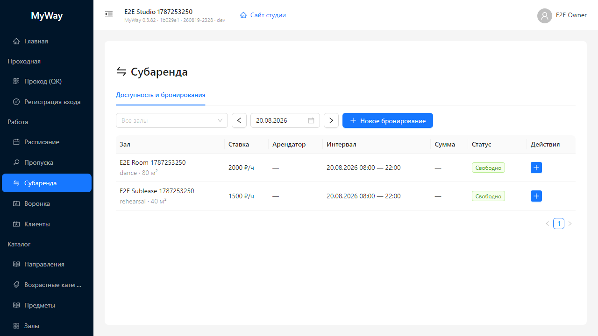

Статусы брони: Черновик, Подтверждено, Отменено, Завершено.

## Финансы

Группа видна, если платформенный флаг `finance.turnoverReport` не выключен (у владельца обычно включён). Администратору доступ нужно выдать отдельно (`PATCH .../access-control` `{ "financeReportForAdmin": true }` — переключателя в настройках нет).

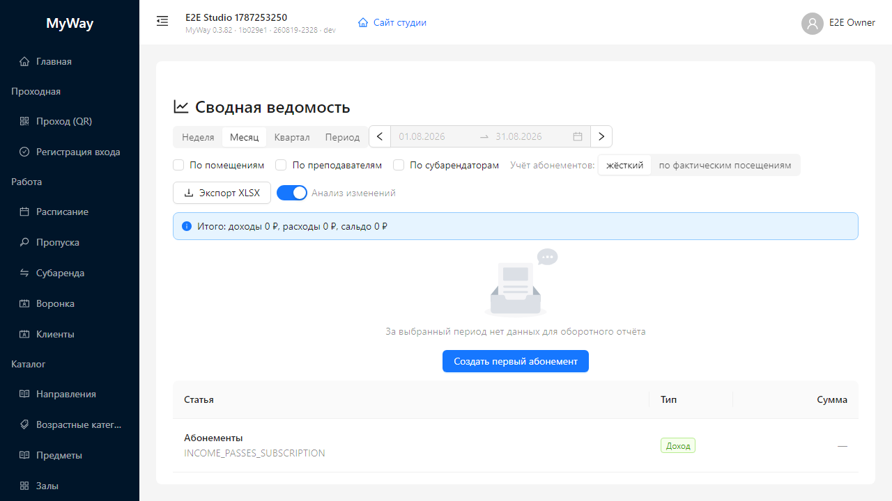

Пункты: **Сводная ведомость** (учёт абонементов: жёсткий / по фактическим посещениям, анализ изменений, экспорт XLSX), **Абонементы**, **Доходы**, **Расходы**, **Коммуналка и счётчики**, **Категории**, **Экспорт 1С**.

Страницы «Начисления по тарифу» нет.

**Коммуналка:** типы услуг, счётчики (к помещению), показания, счета.

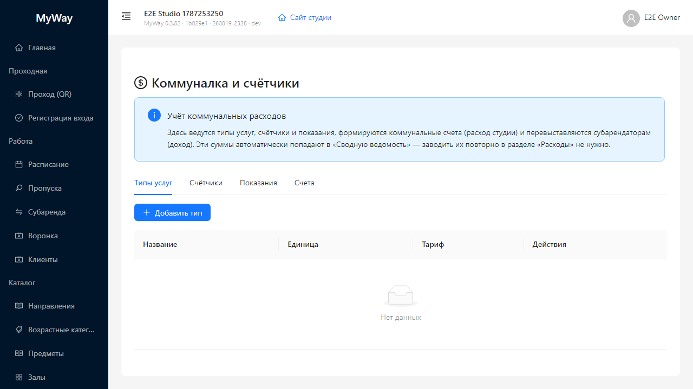

**Экспорт 1С:** период, контрагенты / счета / акты → ZIP.

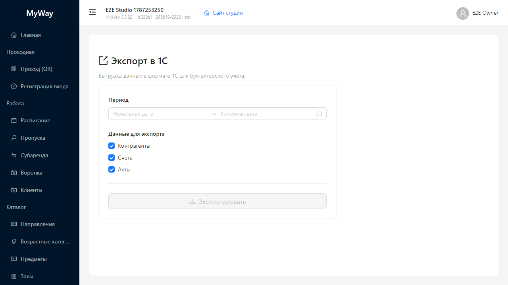

## Настройки и приватность

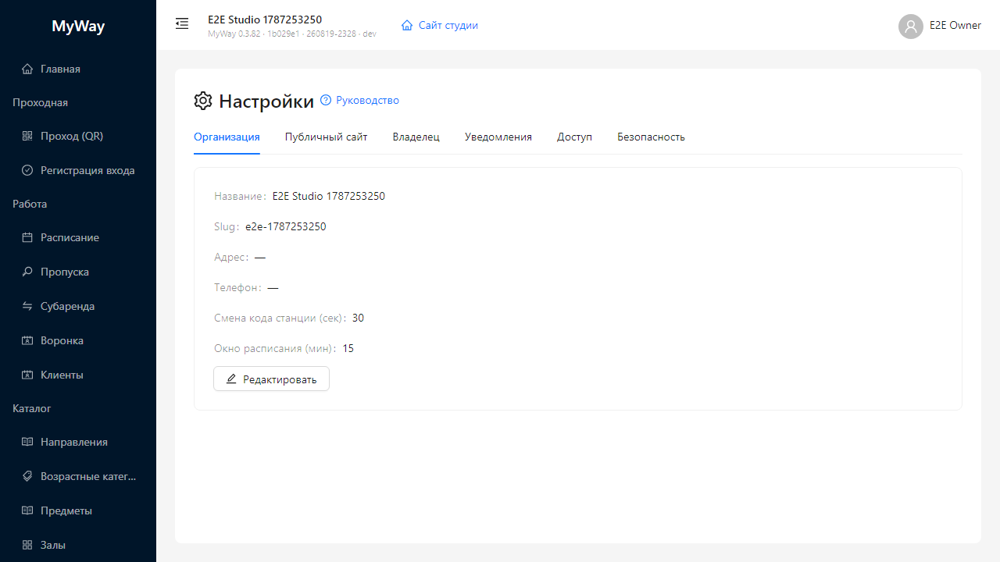

Вкладки: **Организация** (название, смена кода станции 10–300 с, окно расписания ±мин), **Публичный сайт** (SEO, HTML, фото, контакты, «заявки требуют подтверждения», блоки «почему выбирают», галерея, отзывы), **Владелец**, **Уведомления**, **Безопасность**.

Вкладки «Администраторы» нет — персонал в **Сотрудниках**.

**Профиль и приватность** (`/go/account/privacy`): согласия, скачать данные, отозвать маркетинг. **Удалить аккаунт** у владельца неактивно.

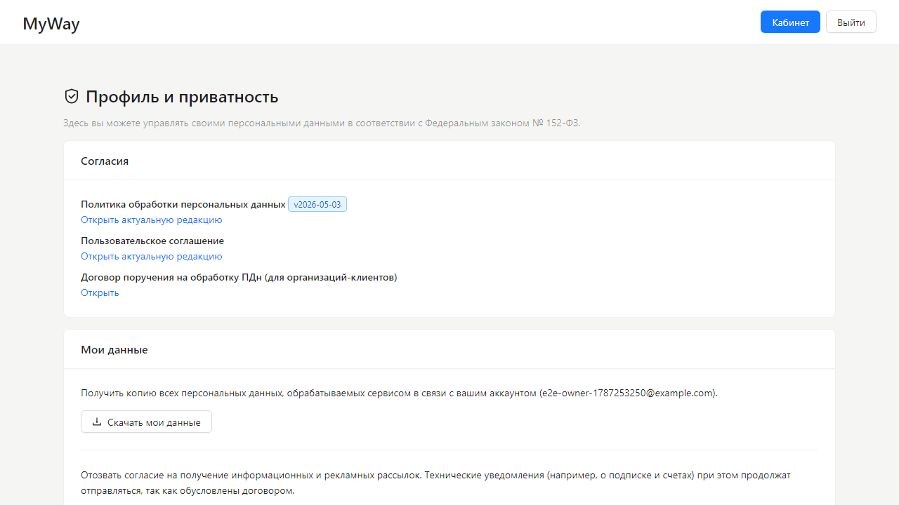

## Проход (QR)

**«Отметка на проходной»**: камера на станционный QR или токен личного пропуска. Ресепшн посетителей — **«Регистрация входа»**, не эта страница.

## Обратная связь и баги

**Обратная связь** — чаты. Вы можете писать супер-админам, сотруднику или студенту (частное или рассылка).

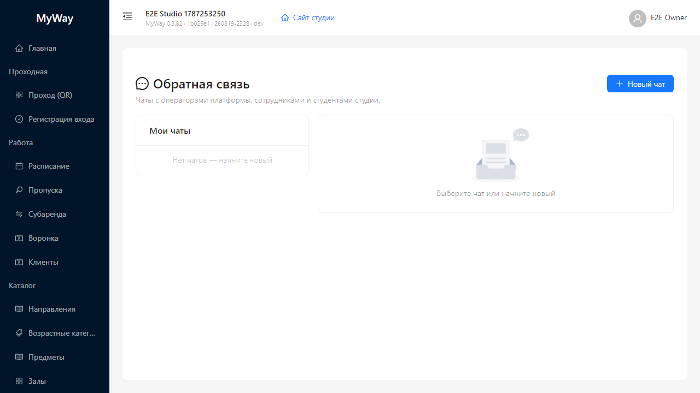

**Баги и предложения** — eTracker, не путать с чатами.

[Оглавление](./README.md)
